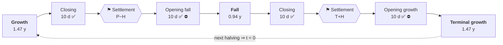

# B4

**Deterministic, non-custodial execution of a Bitcoin-cycle hold strategy — built as a safety
mechanism, not a trading bot.**

A user deposits a directional asset plus canonical USDC into an isolated vault and picks two
target exposures — one for the growth regime, one for the fall regime. Time since the last
proven Bitcoin halving selects and interpolates the active target. One external fact, one
venue (HyperEVM + HyperCore), one accounting model, no admin.

> [!WARNING]
> **Pre-mainnet. Not externally audited. Do not use with real funds.**
> The mandatory funded network gates ([`spec/SECURITY_MODEL.md`](spec/SECURITY_MODEL.md) §5)
> are unmet, and venue semantics cannot be proven off-chain. See [`REPORT.md`](REPORT.md) for
> exactly what is and is not proven.

## What the protocol protects — by construction

The protocol does not guess tops or bottoms. It removes the ways a cycle position dies. Each
protection is **structural** — enforced by code and calendar geometry, not by promises — and
the table marks what is live in the shipped contracts versus specified-and-tested but pending
the leverage-sizing redo (full status: [REPORT.md](REPORT.md)):

| Threat | Structural protection | Status |
|---|---|---|
| Admin/key compromise | **There are no keys.** No upgrade proxy, no pause, no privileged fund mover — nothing for an attacker or insider to take over. | shipped |
| Riding the bear | **The calendar steps aside.** A pure function of time since the proven halving rotates B4/Pro out of the market for the fall regime — the phase where buy-and-hold takes its −76…−84 % cycle drawdown. | shipped |
| Chasing price | **Sized once, then held.** Positions are sized when the calendar rotates and never re-traded against a moving NAV — no volatility drag, no discretionary re-entry. | shipped |
| Stuck execution | **Self-healing by anyone.** Async execution is proven by venue state reads; every step is permissionlessly crankable. Worst reachable state is delayed liveness — never fund loss, never frozen funds. | shipped |
| Exit denial | **The exit cannot be blocked.** Exit liveness depends on no operator, keeper, oracle update or pool interaction; penalties route through guarded one-way paths. | shipped |
| Liquidation by an ordinary swing | **Stops sit at confirmed extremes.** A leveraged position's liquidation is placed by margin size at a price the market already printed and failed to regain — the confirmed low (longs) or peak (shorts) — never a stop order. Verified on every completed cycle: the structural stop was never touched, while a flat-`φ` position is liquidated by the +99–103 % bear rallies (shorts) or the −64 % COVID crash (longs). | **designed** (math + anchors shipped & tested; the vault-engine sizing is flat-`φ` pending the [§7b redo](AUDIT-2026-07-structural-leverage.md)) |

The five shipped protections are what make the benchmark below beat buy-and-hold — **B4, Pro
and Pro Max return a multiple of `HODL` while drawing down materially less**, not by predicting
price but by refusing to hold through the phase that produces the damage. (Mini holds `HODL`'s
exposure by design, so it tracks `HODL`'s drawdown — its edge is the pool, not less risk.) The
structural leverage that makes Pro Max's leverage *survivable* is specified and its math is
tested, but the engine sizes flat-`φ` today — so Pro Max's benchmark leverage is the design
target, not shipped behaviour.

## Documentation

| | |
|---|---|
| **Start here** | [Overview](docs/01-overview.md) → [Core concepts](docs/02-core-concepts.md) |
| **Integrating** | [Integration](docs/04-integration.md) · [Contract map](docs/03-contracts.md) |
| **Auditing** | [Security model](docs/05-security.md) · [`spec/HAZARDS.md`](spec/HAZARDS.md) · [`INVARIANTS.md`](INVARIANTS.md) |
| **Operating** | [Deployment](docs/06-deployment.md) · [Keeper](docs/08-keeper.md) · [Roles](docs/09-roles.md) · [Off-chain stack](docs/10-offchain-architecture.md) |
| **Economics** | [Fees, penalty and the pool](docs/07-fee-routing.md) · [Backtest](docs/11-backtest.md) · [`spec/WHITEPAPER.md`](spec/WHITEPAPER.md) |

Full index: [`docs/README.md`](docs/README.md). The normative specification the
implementation is judged against lives in [`spec/`](spec/) — citations of the form
`HAZARDS A2` or `SPECIFICATION §4` refer to it.

Implementation records: [`ARCHITECTURE.md`](ARCHITECTURE.md) (design decisions) ·
[`REPORT.md`](REPORT.md) (security dossier + audit history) ·
[`SLITHER.md`](SLITHER.md) (static-analysis triage).

## How it works


Three properties define the system:

- **The calendar is a pure function of block time.** Nobody — owner, operator or keeper —
  chooses the regime, the target, the market or the price.
- **Execution is asynchronous and proven, never assumed.** Emitting a CoreWriter action is not
  evidence it executed; the effect must be proven by a later Core state read, and accounting
  credits the *measured balance delta*, never the requested amount. Donations and favourable
  overfills stay unaccounted and separately recoverable.
- **Authority is minimal.** No upgrade proxy, no pause, no privileged fund mover. The worst
  case of any stalled step is delayed liveness, never loss of funds.

## The products

Each product is the previous one plus one more interior move at the two cycle pivots.
`φ = 1.618033988749894848`.

| Product | Growth | Fall | Adds |
|---|---:|---:|---|
| Mini | `1` | `1` | holds spot, trades nothing; earns pool yield |
| B4 | `1` | `0` | a fall-regime rotation into USDC |
| Pro | `1` | `−1` | a full `1×` short in the fall regime |
| Pro Max | `φ` | `−φ` | leveraged expression of the same signs |

A signed target `n` decomposes exactly once, identically for every product:

```
spot = clamp(n, 0, 1)     // directional spot
perp = n − spot           // residual the spot leg cannot express
```

How much accepted holding risk to keep is the user's dial; the protocol takes no directional
view on their behalf.

## The cycle

The two pivots are **not fitted to price history** — they are the golden-ratio self-division
of the interval, so the model carries **zero tuned parameters**. Any other boundary would have
to be calibrated against the handful of completed cycles.

| Pivot | Formula | Share of cycle | Nominal day |
|---|---|---:|---:|
| `P` growth → fall | `cycle/φ²` | 38.20 % | ≈ 557.7 d |
| `T` fall → growth | `cycle/φ` | 61.80 % | ≈ 902.3 d |



✅ free exit · ⛔ deposits closed · nominal cycle `1460 d`, transitions `W = 20 d`, halves
`H = 10 d`. A sign change always passes through a verified zero at a settlement point;
strictly same-sign pairs interpolate directly and never synthesise one — which is why Mini
never trades, yet is still fee'd on interval profit.

Details: [Core concepts](docs/02-core-concepts.md).

## Benchmark — every product vs buy-and-hold, real BTC closes

Positions are sized once per regime and **held** (fixed units, no rebalance drag); Pro Max's
leverage comes from the protocol's own `StructuralLeverage` on both sides — longs bounded by
the confirmed lows, shorts by the confirmed highs. Reproduce:

```bash
forge test --match-path 'test/backtest/*' -vv
```

### Three complete cycles, compounded (2012-11-28 → 2024-04-20)

Product mechanics only — the pool is a separate yield (below), so nothing is double-counted.

| Strategy | Total return | Worst drawdown | Worst vs deposit |
|---|---:|---:|---:|
| `HODL` buy & hold | 5,214x | 84.2 % | −13.2 % |
| Mini | 4,809x | 84.5 % | −13.2 % |
| **B4** | **114,693x** | **73.9 %** | −13.2 % |
| **Pro** | **425,918x** | **73.9 %** | −13.2 % |
| **Pro Max** | **22,542,031x** | **75.5 %** | −33.6 % |

### Per cycle — return and drawdown side by side

| Cycle | | `HODL` | Mini | B4 | Pro | Pro Max |
|---|---|---:|---:|---:|---:|---:|
| **2012→2016** | return | 52.3x | 50.9x | 140.9x | 216.4x | 576.8x |
| | max DD | 84.2 % | 84.5 % | **73.9 %** | **73.9 %** | 75.5 % |
| **2016→2020** | return | 13.6x | 13.2x | 39.1x | 61.0x | 209.2x |
| | max DD | 83.2 % | 83.4 % | **64.2 %** | **64.2 %** | 74.0 % |
| **2020→2024** | return | 7.3x | 7.1x | 20.8x | 32.3x | 186.8x |
| | max DD | 76.5 % | 76.8 % | **53.1 %** | **53.1 %** | 58.9 % |
| **2024→now**\* | return | 1.00x | 1.00x | 1.66x | 2.20x | 5.78x |
| | max DD | 53.0 % | 53.3 % | **28.2 %** | **28.2 %** | 51.9 % |

<sub>\* cycle in progress. Pro Max structural leverage per cycle — long at the halving:
1.6× / 2.5× / 2.7× / 2.2×; short at the 38.2 % pivot: 1.6× / 1.2× / 2.4× / 4.8× — set by the
confirmed extremes, not a flat multiple.</sub>

Read the two rows together, cycle by cycle: **more return, less drawdown.** B4 and Pro cut
10–25 pp off `HODL`'s cycle drawdown because they are simply *not in the market* during the
bear that produces it; what drawdown remains is intra-bull volatility, and it gives back
profit, not principal (B4 ends at −0.3 % vs the deposit in cycle 1 despite a 74 % swing).
Pro Max carries real leveraged downside (−33.6 % vs deposit, cycle 2) — the table shows it
rather than hiding it. Mini holds `HODL`'s exposure and pays the operator fee, so its
*product* return sits just under `HODL` — its edge is entirely the pool yield below.

### The survival record — the safety mechanism, measured

| Event (real data) | Flat-`φ` position | Structural position |
|---|---|---|
| Bear rally +103 % (2015: $152 → $310) | **liquidated** | survives — stop pinned above the confirmed peak |
| Bear rally +99 % (2018: $5,921 → $11,780) | **liquidated** | survives |
| COVID crash −64 % (2020: $13,838 → $4,953) | **liquidated** | survives — stop below the confirmed bottom |
| Every completed cycle, both pivots | — | **the structural stop was never touched** |

After the 38.2 % pivot the price never returned to the confirmed peak (it stayed 1–23 %
below); after the 62 % window it never broke the confirmed bottom (the low stayed +150 %
above the long's stop). The stops are placed where the market has already proven it cannot
go — that is the design, and four cycles of data agree with it.

### Pool yield — the forfeited penalties ride the halving cycle

Exits outside the free windows pay a `q = 11.8 %` penalty into the shared pool, redistributed
to stayers. But the pool is **not** a flat percentage credit — it is a fund that holds that
penalty **in kind** (BTC through the growth regime) and distributes it at the settlement points,
so the early-cycle penalties, accrued when BTC is cheap and realized near the cycle peak,
**appreciate with the halving**. Modelled daily on the real series — a `$100/day` cohort marks
`r` of each day's inflow as penalty — the pool distributes a *multiple* of what it took in:

| Cycle | BTC (halving → next) | penalty in (10 % / 20 %) | **distributed** (10 % / 20 %) | **yield** |
|---|---|---:|---:|---:|
| 2012→2016 | $12 → $642 | $13,190 / $26,380 | **$56,890 / $113,781** | **4.3×** |
| 2016→2020 | $642 → $8,759 | $14,020 / $28,040 | **$69,561 / $139,123** | **5.0×** |
| 2020→2024 | $8,759 → $64,895 | $14,400 / $28,800 | **$21,121 / $42,243** | **1.5×** |

The multiple is **rate-independent** (linear) — going from 10 % to 20 % doubles the dollars,
not the yield. The pool captures BTC's growth-regime appreciation on the accumulated inventory,
which the old flat `+2.95 %/cycle` figure entirely missed. With the designed fall-short
([tranches](PROPOSAL-pool-tranches.md)) the fall-regime penalties also gain, adding a further
`+2…7 %`. In a flat market the yield collapses toward `1×` (no appreciation to capture) — but
that is exactly when the *redistribution* matters most: a Mini stayer's product return there
merely tracks `HODL` (both ≈ 1.0× in the cycle in progress), so the pool is the entire edge.
Reproduce: `forge test --match-test test_pool_economics -vv`.

> [!NOTE]
> **Scope of the numbers.** Three completed cycles is not a statistical sample (~32 halvings
> will ever exist); multiples assume entry at the pivots, infinite depth, no slippage/impact/
> trading fees; perps were not liquid before ~2016, so early-cycle Pro/Pro Max are
> hypotheticals; pool income uses the 20 %-exit behavioural assumption. The `StructuralLeverage`
> math and both anchor ratchet concepts are shipped and tested; the vault-engine sizing runs
> flat-`φ` until the §7b redo lands ([audit record](AUDIT-2026-07-structural-leverage.md)).

Method and every omitted cost: [Backtest](docs/11-backtest.md).

## Versioning: no upgrade path, by design

Every contract is immutable — no proxy, no pause, no admin who can reach into a live vault.
Safety comes from correctness by construction plus the owner's exit right, the same model as
Bitcoin and Uniswap V1/V2/V3.

The consequence is explicit: **a fix is a new deployment, not a patch.** A defect in `v1` is
addressed by deploying a re-audited `v2` alongside it; `v1` keeps running exactly as written.
Vaults are clones bound to their implementation and do not migrate automatically — a user
moves by exiting and re-entering, which is free inside a transition window and otherwise costs
the ordinary exit penalty.

## Build & test

Requires [Foundry](https://book.getfoundry.sh/); Solidity `0.8.28` is pinned in `foundry.toml`.

```bash
forge build --sizes   # every contract must fit EIP-170
forge fmt --check
forge test            # unit + integration + invariant campaigns

FOUNDRY_PROFILE=deep forge test --match-path 'test/invariant/*'   # nightly deep profile
slither . --fail-high                                            # release gate, also in CI
```

## Repository layout

```text
src/
  core/       B4Factory · B4Pool · B4Vault (+Storage/Engine/Ops) · HalvingOracle
  venue/      HyperCore types, precompile readers, CoreWriter encoding, descriptors
  libraries/  Phi (fixed point + φ) · Calendar · BtcHeader · SafeTransfer
  periphery/  Keeper · reference strategies
  citrea/     HalvingProver (source-chain publisher)
test/         unit · integration · invariant campaigns · adversarial HyperCore mock
script/       deployment wiring
data/         BTC daily closes used by the historical demo
spec/         the normative specification package
docs/         guides
```

## Security

Report vulnerabilities privately — see [`SECURITY.md`](SECURITY.md). Please do not open a
public issue for a suspected vulnerability.

There is no admin key and no pause, so a live deployment cannot be halted; that is precisely
why pre-deployment reports matter.

## License

[MIT](LICENSE) — matching the SPDX header on every source file.
