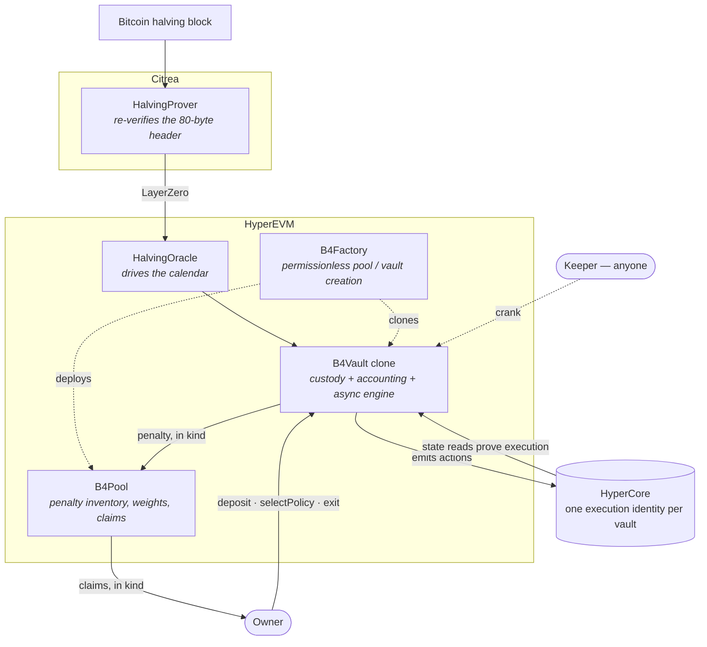
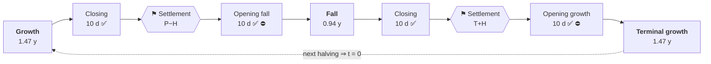

# B4

**Deterministic, non-custodial execution of a Bitcoin-cycle hold strategy.**

A user deposits a directional asset plus canonical USDC into an isolated vault and picks two
target exposures — one for the growth regime, one for the fall regime. Time since the last
proven Bitcoin halving selects and interpolates the active target. One external fact, one
venue (HyperEVM + HyperCore), one accounting model, no admin.

> [!WARNING]
> **Pre-mainnet. Not externally audited. Do not use with real funds.**
> The mandatory funded network gates ([`spec/SECURITY_MODEL.md`](spec/SECURITY_MODEL.md) §5)
> are unmet, and venue semantics cannot be proven off-chain. See [`REPORT.md`](REPORT.md) for
> exactly what is and is not proven.

## Documentation

| | |
|---|---|
| **Start here** | [Overview](docs/01-overview.md) → [Core concepts](docs/02-core-concepts.md) |
| **Integrating** | [Integration](docs/04-integration.md) · [Contract map](docs/03-contracts.md) |
| **Auditing** | [Security model](docs/05-security.md) · [`spec/HAZARDS.md`](spec/HAZARDS.md) · [`INVARIANTS.md`](INVARIANTS.md) |
| **Operating** | [Deployment](docs/06-deployment.md) · [Keeper](docs/08-keeper.md) · [Roles](docs/09-roles.md) · [Off-chain stack](docs/10-offchain-architecture.md) |
| **Economics** | [Fees, penalty and the pool](docs/07-fee-routing.md) · [Backtest](docs/11-backtest.md) · [`spec/WHITEPAPER.md`](spec/WHITEPAPER.md) |

Full index: [`docs/README.md`](docs/README.md). The normative specification the
implementation is judged against lives in [`spec/`](spec/) — citations of the form
`HAZARDS A2` or `SPECIFICATION §4` refer to it.

Implementation records: [`ARCHITECTURE.md`](ARCHITECTURE.md) (design decisions) ·
[`REPORT.md`](REPORT.md) (security dossier + audit history) ·
[`SLITHER.md`](SLITHER.md) (static-analysis triage).

## How it works



Three properties define the system:

- **The calendar is a pure function of block time.** Nobody — owner, operator or keeper —
  chooses the regime, the target, the market or the price.
- **Execution is asynchronous and proven, never assumed.** Emitting a CoreWriter action is not
  evidence it executed; the effect must be proven by a later Core state read, and accounting
  credits the *measured balance delta*, never the requested amount. Donations and favourable
  overfills stay unaccounted and separately recoverable.
- **Authority is minimal.** No upgrade proxy, no pause, no privileged fund mover. The worst
  case of any stalled step is delayed liveness, never loss of funds.

## The products

Each product is the previous one plus one more interior move at the two cycle pivots.
`φ = 1.618033988749894848`.

| Product | Growth | Fall | Adds |
|---|---:|---:|---|
| Mini | `1` | `1` | holds spot, trades nothing; earns pool yield |
| B4 | `1` | `0` | a fall-regime rotation into USDC |
| Pro | `1` | `−1` | a full `1×` short in the fall regime |
| Pro Max | `φ` | `−φ` | leveraged expression of the same signs |

A signed target `n` decomposes exactly once, identically for every product:

```
spot = clamp(n, 0, 1)     // directional spot
perp = n − spot           // residual the spot leg cannot express
```

How much accepted holding risk to keep is the user's dial; the protocol takes no directional
view on their behalf.

## The cycle

The two pivots are **not fitted to price history** — they are the golden-ratio self-division
of the interval, so the model carries **zero tuned parameters**. Any other boundary would have
to be calibrated against the handful of completed cycles.

| Pivot | Formula | Share of cycle | Nominal day |
|---|---|---:|---:|
| `P` growth → fall | `cycle/φ²` | 38.20 % | ≈ 557.7 d |
| `T` fall → growth | `cycle/φ` | 61.80 % | ≈ 902.3 d |



✅ free exit · ⛔ deposits closed · nominal cycle `1460 d`, transitions `W = 20 d`, halves
`H = 10 d`. A sign change always passes through a verified zero at a settlement point;
strictly same-sign pairs interpolate directly and never synthesise one — which is why Mini
never trades, yet is still fee'd on interval profit.

Details: [Core concepts](docs/02-core-concepts.md).

## Historical demo

The four products over real BTC daily closes, sized once per regime and **held** (fixed
units, no daily rebalance), with Pro Max's leverage from `StructuralLeverage` — the
protocol's own function, bounded by the cycle's confirmed lows.

```bash
forge test --match-path 'test/backtest/*' -vv
```

### Leaderboard — 3 complete cycles, compounded (2012-11-28 → 2024-04-20)

More return **and** less drawdown than holding, in one table. `1.00x` = deposit.

| Strategy | Total return | Worst drawdown | Worst vs deposit | Pool income |
|---|---:|---:|---:|---:|
| `HODL` buy & hold | 5,214x | 84.2 % | −13.2 % | — |
| Mini | 5,415x | 84.5 % | −13.2 % | ×1.09 |
| **B4** | **125,149x** | **73.9 %** | −13.2 % | ×1.09 |
| **Pro** | **464,746x** | **73.9 %** | −13.2 % | ×1.09 |
| Pro Max | 14,893,463x | 75.5 % | −33.6 % | ×1.09 |

### Per cycle

| Cycle | | `HODL` | Mini | B4 | Pro | Pro Max |
|---|---|---:|---:|---:|---:|---:|
| **2012→2016** | return | 52.3x | 52.9x | 145.1x | 222.8x | 471.0x |
| | max DD | 84.2 % | 84.5 % | 73.9 % | 73.9 % | 75.5 % |
| | DD landed in | `FALL` | `FALL` | `GROWTH` | `GROWTH` | `GROWTH` |
| **2016→2020** | return | 13.6x | 13.8x | 40.3x | 62.8x | 209.9x |
| | max DD | 83.2 % | 83.4 % | 64.2 % | 64.2 % | 67.9 % |
| | DD landed in | `FALL` | `FALL` | `RECOV` | `RECOV` | `RECOV` |
| **2020→2024** | return | 7.3x | 7.4x | 21.4x | 33.2x | 150.6x |
| | max DD | 76.5 % | 76.8 % | 53.1 % | 53.1 % | 58.9 % |
| | DD landed in | `RECOV` | `RECOV` | `GROWTH` | `GROWTH` | `GROWTH` |
| **2024→now**\* | return | 1.00x | 1.03x | 1.71x | 2.26x | 3.71x |
| | max DD | 53.0 % | 53.3 % | 28.2 % | 28.2 % | 51.9 % |
| | DD landed in | `FALL` | `FALL` | `GROWTH` | `GROWTH` | `GROWTH` |

<sub>\* cycle in progress. Pro Max entry leverage per cycle: 1.6× / 2.5× / 2.7× / 2.2× —
structural, not flat.</sub>

**Where the drawdown comes from — and why it is not the bear.** B4/Pro sit in **USDC through
the fall**, so they cannot draw down there at all. Their worst days land in `GROWTH`/`RECOV`
— violent *intra-bull* crashes — while `HODL`'s worst days land in the phase B4 sits out:

| Cycle | `HODL` worst day | | B4 worst day | |
|---|---|---|---|---|
| 2012→2016 | 2015-01-14 | `FALL` (bear bottom) | 2013-04-11 | `GROWTH` (April-2013 crash) |
| 2016→2020 | 2018-12-15 | `FALL` (bear bottom) | 2020-03-16 | `RECOV` (COVID) |
| 2020→2024 | 2022-11-21 | `RECOV` (FTX) | 2021-07-20 | `GROWTH` (May-2021 crash) |

### Pool income — the core value capture

**20 % of the cohort exits through the `q = 11.8 %` penalty door each cycle**, redistributed
to the ~80 % who stay: **+0.25·q ≈ +2.95 % per cycle to every stayer**, included in every
number above. Mini holds *exactly* `HODL`'s exposure, so the Mini−`HODL` gap **is** the pool:

| Cycle | Mini | `HODL` | Pool share of Mini's profit |
|---|---:|---:|---:|
| 2012→2016 | 52.9x | 52.3x | 2.9 % |
| 2016→2020 | 13.8x | 13.6x | 3.0 % |
| 2020→2024 | 7.4x | 7.3x | 3.3 % |
| 2024→now (flat cycle) | 1.03x | 1.00x | **92.9 %** |

In a bull cycle the pool is a ~3 % bonus on top of price. In a **flat cycle it is essentially
the entire return** — the protocol pays stayers when the market does not.

**Drawdown ≠ loss.** B4 swings ~74 % peak-to-trough yet ends at **−0.3 % vs the deposit** —
the swing gives back *profit*, not principal, if you entered at the halving. Pro Max genuinely
risks a third to a half of the deposit; leverage cuts both ways and the table shows it.

> [!IMPORTANT]
> **Illustration of the mechanism — not evidence of edge, and not a forecast.** Three
> completed cycles is not a statistical sample and never can be (~32 halvings will ever
> occur). Multiples are *arithmetic under perfect timing* — entry at the halving, infinite
> depth at any size, no slippage or market impact — not outcomes. Perps were not liquid
> before ~2016, so Pro/Pro Max in the early cycles are historical hypotheticals. Pool income
> rests on a behavioural assumption (20 % exit penalised per cycle).

Method, the structural-leverage mechanism, and every omitted cost: [Backtest](docs/11-backtest.md).

## Versioning: no upgrade path, by design

Every contract is immutable — no proxy, no pause, no admin who can reach into a live vault.
Safety comes from correctness by construction plus the owner's exit right, the same model as
Bitcoin and Uniswap V1/V2/V3.

The consequence is explicit: **a fix is a new deployment, not a patch.** A defect in `v1` is
addressed by deploying a re-audited `v2` alongside it; `v1` keeps running exactly as written.
Vaults are clones bound to their implementation and do not migrate automatically — a user
moves by exiting and re-entering, which is free inside a transition window and otherwise costs
the ordinary exit penalty.

## Build & test

Requires [Foundry](https://book.getfoundry.sh/); Solidity `0.8.28` is pinned in `foundry.toml`.

```bash
forge build --sizes   # every contract must fit EIP-170
forge fmt --check
forge test            # unit + integration + invariant campaigns

FOUNDRY_PROFILE=deep forge test --match-path 'test/invariant/*'   # nightly deep profile
slither . --fail-high                                            # release gate, also in CI
```

## Repository layout

```text
src/
  core/       B4Factory · B4Pool · B4Vault (+Storage/Engine/Ops) · HalvingOracle
  venue/      HyperCore types, precompile readers, CoreWriter encoding, descriptors
  libraries/  Phi (fixed point + φ) · Calendar · BtcHeader · SafeTransfer
  periphery/  Keeper · reference strategies
  citrea/     HalvingProver (source-chain publisher)
test/         unit · integration · invariant campaigns · adversarial HyperCore mock
script/       deployment wiring
data/         BTC daily closes used by the historical demo
spec/         the normative specification package
docs/         guides
```

## Security

Report vulnerabilities privately — see [`SECURITY.md`](SECURITY.md). Please do not open a
public issue for a suspected vulnerability.

There is no admin key and no pause, so a live deployment cannot be halted; that is precisely
why pre-deployment reports matter.

## License

[MIT](LICENSE) — matching the SPDX header on every source file.
