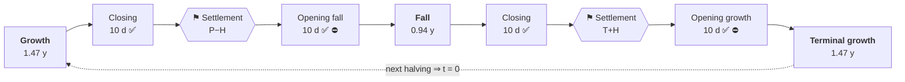

# B4

**Deterministic, non-custodial execution of a Bitcoin-cycle hold strategy.**

A user deposits a directional asset plus canonical USDC into an isolated vault and picks two
target exposures — one for the growth regime, one for the fall regime. Time since the last
proven Bitcoin halving selects and interpolates the active target. One external fact, one
venue (HyperEVM + HyperCore), one accounting model, no admin.

> [!WARNING]
> **Pre-mainnet. Not externally audited. Do not use with real funds.**
> The mandatory funded network gates ([`spec/SECURITY_MODEL.md`](spec/SECURITY_MODEL.md) §5)
> are unmet, and venue semantics cannot be proven off-chain. See [`REPORT.md`](REPORT.md) for
> exactly what is and is not proven.

## Documentation

| | |
|---|---|
| **Start here** | [Overview](docs/01-overview.md) → [Core concepts](docs/02-core-concepts.md) |
| **Integrating** | [Integration](docs/04-integration.md) · [Contract map](docs/03-contracts.md) |
| **Auditing** | [Security model](docs/05-security.md) · [`spec/HAZARDS.md`](spec/HAZARDS.md) · [`INVARIANTS.md`](INVARIANTS.md) |
| **Operating** | [Deployment](docs/06-deployment.md) · [Keeper](docs/08-keeper.md) · [Roles](docs/09-roles.md) · [Off-chain stack](docs/10-offchain-architecture.md) |
| **Economics** | [Fees, penalty and the pool](docs/07-fee-routing.md) · [`spec/WHITEPAPER.md`](spec/WHITEPAPER.md) |

Full index: [`docs/README.md`](docs/README.md). The normative specification the
implementation is judged against lives in [`spec/`](spec/) — citations of the form
`HAZARDS A2` or `SPECIFICATION §4` refer to it.

Implementation records: [`ARCHITECTURE.md`](ARCHITECTURE.md) (design decisions) ·
[`REPORT.md`](REPORT.md) (security dossier + audit history) ·
[`SLITHER.md`](SLITHER.md) (static-analysis triage).

## How it works


Three properties define the system:

- **The calendar is a pure function of block time.** Nobody — owner, operator or keeper —
  chooses the regime, the target, the market or the price.
- **Execution is asynchronous and proven, never assumed.** Emitting a CoreWriter action is not
  evidence it executed; the effect must be proven by a later Core state read, and accounting
  credits the *measured balance delta*, never the requested amount. Donations and favourable
  overfills stay unaccounted and separately recoverable.
- **Authority is minimal.** No upgrade proxy, no pause, no privileged fund mover. The worst
  case of any stalled step is delayed liveness, never loss of funds.

## The products

Each product is the previous one plus one more interior move at the two cycle pivots.
`φ = 1.618033988749894848`.

| Product | Growth | Fall | Adds |
|---|---:|---:|---|
| Mini | `1` | `1` | holds spot, trades nothing; earns pool yield |
| B4 | `1` | `0` | a fall-regime rotation into USDC |
| Pro | `1` | `−1/φ` | a hedge — short in the fall regime |
| Pro Max | `φ` | `−φ` | leveraged expression of the same signs |

A signed target `n` decomposes exactly once, identically for every product:

```
spot = clamp(n, 0, 1)     // directional spot
perp = n − spot           // residual the spot leg cannot express
```

How much accepted holding risk to keep is the user's dial; the protocol takes no directional
view on their behalf.

## The cycle

The two pivots are **not fitted to price history** — they are the golden-ratio self-division
of the interval, so the model carries **zero tuned parameters**. Any other boundary would have
to be calibrated against the handful of completed cycles.

| Pivot | Formula | Share of cycle | Nominal day |
|---|---|---:|---:|
| `P` growth → fall | `cycle/φ²` | 38.20 % | ≈ 557.7 d |
| `T` fall → growth | `cycle/φ` | 61.80 % | ≈ 902.3 d |



✅ free exit · ⛔ deposits closed · nominal cycle `1460 d`, transitions `W = 20 d`, halves
`H = 10 d`. A sign change always passes through a verified zero at a settlement point;
strictly same-sign pairs interpolate directly and never synthesise one — which is why Mini
never trades, yet is still fee'd on interval profit.

Details: [Core concepts](docs/02-core-concepts.md).

## Versioning: no upgrade path, by design

Every contract is immutable — no proxy, no pause, no admin who can reach into a live vault.
Safety comes from correctness by construction plus the owner's exit right, the same model as
Bitcoin and Uniswap V1/V2/V3.

The consequence is explicit: **a fix is a new deployment, not a patch.** A defect in `v1` is
addressed by deploying a re-audited `v2` alongside it; `v1` keeps running exactly as written.
Vaults are clones bound to their implementation and do not migrate automatically — a user
moves by exiting and re-entering, which is free inside a transition window and otherwise costs
the ordinary exit penalty.

## Build & test

Requires [Foundry](https://book.getfoundry.sh/); Solidity `0.8.28` is pinned in `foundry.toml`.

```bash
forge build --sizes   # every contract must fit EIP-170
forge fmt --check
forge test            # unit + integration + invariant campaigns

FOUNDRY_PROFILE=deep forge test --match-path 'test/invariant/*'   # nightly deep profile
slither . --fail-high                                            # release gate, also in CI
```

## Repository layout

```text
src/
  core/       B4Factory · B4Pool · B4Vault (+Storage/Engine/Ops) · HalvingOracle
  venue/      HyperCore types, precompile readers, CoreWriter encoding, descriptors
  libraries/  Phi (fixed point + φ) · Calendar · BtcHeader · SafeTransfer
  periphery/  Keeper · reference strategies
  citrea/     HalvingProver (source-chain publisher)
test/         unit · integration · invariant campaigns · adversarial HyperCore mock
script/       deployment wiring
spec/         the normative specification package
docs/         guides
```

## Security

Report vulnerabilities privately — see [`SECURITY.md`](SECURITY.md). Please do not open a
public issue for a suspected vulnerability.

There is no admin key and no pause, so a live deployment cannot be halted; that is precisely
why pre-deployment reports matter.

## License

[MIT](LICENSE) — matching the SPDX header on every source file.
