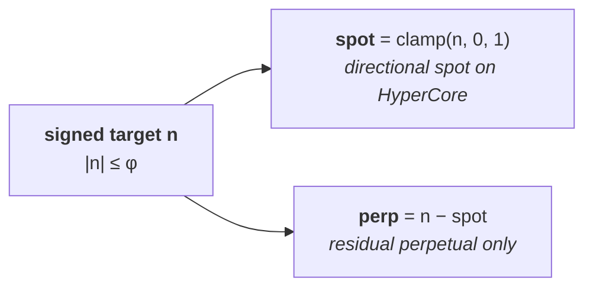
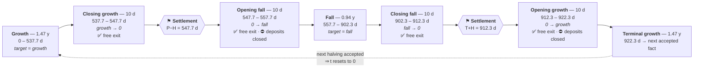
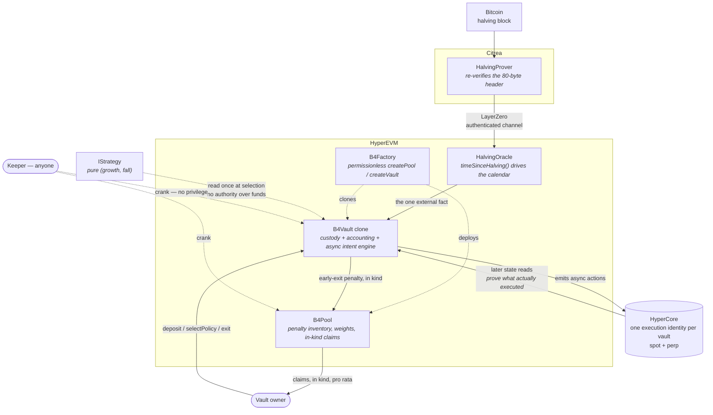
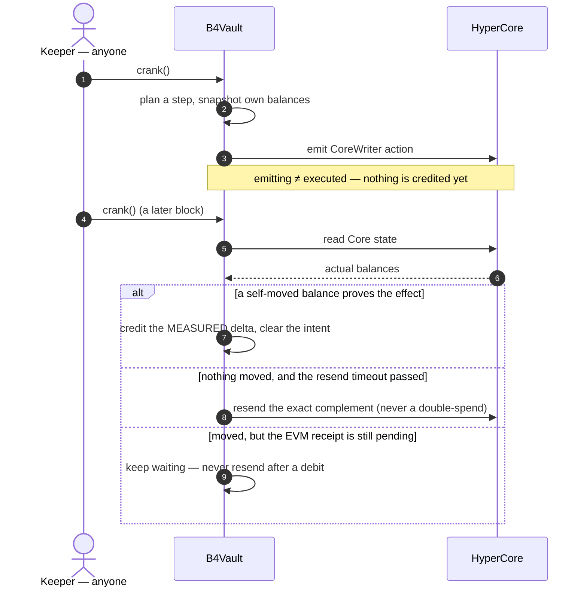
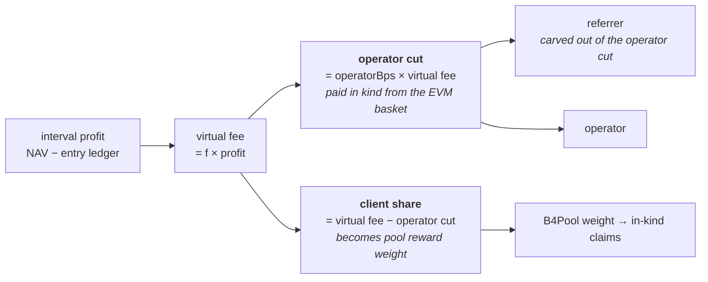
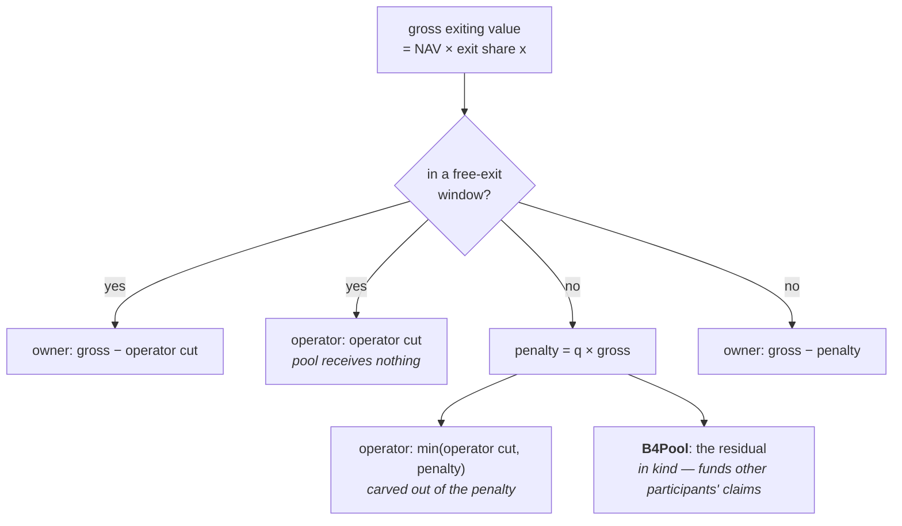

# B4 — deterministic infrastructure for Bitcoin-cycle hold strategies

B4 turns a long-horizon, Bitcoin-cycle hold rule into **non-custodial on-chain execution**.
A user deposits a liquid directional asset plus canonical USDC into an isolated vault and
picks two target exposures — one for the growth regime, one for the fall regime. Time since
the latest *proven* Bitcoin halving deterministically selects and interpolates the active
target.

One external fact (the halving), one execution venue (HyperEVM + HyperCore), one accounting
model, and minimal authority: **the vault, pool and factory contracts have no admin, no
upgrade proxy, no pause, and no privileged fund mover.**

Two authority boundaries do exist and are disclosed rather than hidden: each vault's own
fixed **owner** may deposit, re-select a policy, exit, and recover unaccounted assets *from
their own vault only* (they cannot change the fee route or touch another vault); and each
LayerZero-side contract (`HalvingOracle`, `HalvingProver`) carries a temporary **configurator
delegate** that must be permanently renounced via `renounceDelegate()` before production —
verifying that on-chain is a release gate.

> ### ⚠️ Status: pre-mainnet, not externally audited
> This code has **not** had an independent external audit, and the mandatory funded
> network gates (`spec/SECURITY_MODEL.md` §5) are **not** met. Venue semantics — CoreWriter
> action atomicity, fresh-account activation, precompile behavior — cannot be proven off-chain
> and are unverified here. **Do not use with real funds.** See [`REPORT.md`](REPORT.md).

## The product ladder

Each product is the previous one plus one more interior move at the two cycle pivots.
`φ = 1.618033988749894848`.

| Product | Growth target | Fall target | Adds vs. previous |
|---|---:|---:|---|
| Mini | `1` | `1` | hold spot; earns shared-Pool yield, trades nothing |
| B4 | `1` | `0` | a fall-regime rotation into USDC |
| Pro | `1` | `−1/φ` | a hedge (short in the fall regime) |
| Pro Max | `φ` | `−φ` | leveraged expression of the same signs |

How much accepted holding risk to keep is the user's dial — the protocol takes no
directional view on their behalf.

### One exposure equation for every product

A signed target `n` decomposes exactly once. Spot carries what spot can express; the
perpetual carries only the residual.



| Target `n` | → spot | → perp | Meaning | Where it occurs |
|---:|---:|---:|---|---|
| `1` | `1` | `0` | plain hold, no perp | Mini (both regimes), B4/Pro growth |
| `0` | `0` | `0` | fully rotated into USDC | B4 fall |
| `−1/φ` | `0` | `−1/φ` | net short, spot sold | Pro fall |
| `φ` | `1` | `φ − 1` | levered long | Pro Max growth |
| `−φ` | `0` | `−φ` | levered short | Pro Max fall |

### The deterministic calendar

`t` is time since the latest accepted halving fact — a pure function of block time. Nobody
chooses the regime: not the owner, not a keeper, not an operator.

The two pivots are **not fitted to price history** — they are the golden-ratio self-division
of the interval, which is why the model has **zero tuned parameters**:

| Pivot | Formula | Share of cycle | Nominal day |
|---|---|---:|---:|
| `P` growth → fall | `cycle/φ²` = `1/φ² × cycle` | **38.20 %** | ≈ 557.7 d |
| `T` fall → growth | `cycle/φ` = `1/φ × cycle` | **61.80 %** | ≈ 902.3 d |

Any other boundary would have to be calibrated against the handful of completed cycles —
i.e. overfitting. These two are the only division where `whole / larger = larger / smaller`.
Transitions are `W = 20 d` wide with halves `H = 10 d`; the nominal cycle is `1460 d`.



Two things the picture encodes:

- **A sign change always passes through a verified zero.** When the two targets differ in sign
  (or one is zero), the transition is split at the settlement point, so the previous regime's
  exposure fully unwinds before the opposite one opens. Strictly same-sign pairs — Mini's
  `(1, 1)` — interpolate directly and never visit a synthetic zero, so Mini never trades; its
  interval profit is still fee'd.
- **Settlement points are fixed and product-independent** (`P−H` and `T+H`). An interval runs
  from one point to the next; the one beginning at `T+H` crosses the epoch boundary.

The calendar rests in terminal growth until the *next real halving fact* is accepted — no
wall-clock window ever gates acceptance, and nothing depends on the realized interval matching
the nominal 1460 days.

## How it fits together



### Execution is asynchronous — and that is the hard part

Emitting a CoreWriter action is **not** evidence it executed. Every effect must be proven by a
later Core state read, and accounting only ever credits the **actual measured balance delta** —
never the requested amount. Donations and favorable overfills stay unaccounted and separately
recoverable.



Worst case of any stalled step is **delayed liveness, never loss** — every step stays
independently callable by anyone.

## Versioning: there is no upgrade path, by design

Every contract is immutable. There is no proxy, no `pause`, and no admin who can intervene —
the same model as Bitcoin and Uniswap V1/V2/V3. Safety comes from *correctness by
construction plus the owner's exit right*, not from a multisig that can reach into a live
vault.

The consequence is explicit: **a fix is a new deployment, not a patch.**

- A defect found in `v1` is addressed by deploying `v2` — re-audited — alongside it. `v1`
  keeps running exactly as written; nothing about it silently changes under its users.
- Existing vaults are EIP-1167 clones bound to their implementation. **They do not migrate
  automatically.** A user moves by exiting their `v1` vault and entering a `v2` one.
- Exiting inside a **free window** costs no penalty (`✅` above — the two 20-day transitions
  plus 20 days after each accepted halving fact). Outside one, the ordinary `q` penalty
  applies — that penalty *is* the protocol's core mechanic, not a migration toll.

So the natural migration moment is a transition window, which is also when a
calendar-driven strategy is flat or rotating anyway. Expecting a protocol to be refined
indefinitely before it ever ships is not a safety model; shipping immutable versions that
users can leave on their own terms is.

## Where value flows

Two moments move value: a **settlement checkpoint** (performance fee on interval profit) and
an **exit**. In both, the operator payment is carved *out of* the amount — never added on top —
and the referral is carved out of the operator's share in turn.

**At settlement** — `f ≈ 4.5084971874737120%` of profit over the entry ledger:



Settlement **reverts** (`FeeNotRepatriated`) unless the EVM basket can cover the operator cut,
so a Core-heavy vault must repatriate before it can settle — it cannot dodge the fee while
still reporting full reward weight.

**At exit** — a free window costs no penalty; outside one, a single in-kind penalty
`q ≈ 11.8033988749894848%` of the exiting gross applies:



In both branches `owner + operator + pool = gross` exactly. Free windows are the two `20 d`
transitions plus `20 d` after each newly accepted halving fact.

## Documentation

**Start here:** [`docs/01-overview.md`](docs/01-overview.md) · full index in
[`docs/README.md`](docs/README.md)

| Guide | |
|---|---|
| [01 Overview](docs/01-overview.md) | What B4 is, the ladder, the external anchors |
| [02 Core concepts](docs/02-core-concepts.md) | Calendar, exposure equation, vault vs pool |
| [03 Contract map](docs/03-contracts.md) | What each contract does and may not do |
| [04 Integration](docs/04-integration.md) | Signatures, lifecycle, events — build on B4 |
| [05 Security](docs/05-security.md) | Trust model, invariants, audit posture |
| [06 Deployment](docs/06-deployment.md) | Runbook + the funded release-gate checklist |
| [07 Fees & pool](docs/07-fee-routing.md) | Performance fee, fee route, exit penalty, claims |
| [08 Keeper](docs/08-keeper.md) | Running the permissionless crank |
| [09 Roles](docs/09-roles.md) | Owner / operator / referrer / keeper — flows, earnings, limits |

**Normative specification** (`spec/`) — what the implementation is judged against:

- [`spec/WHITEPAPER.md`](spec/WHITEPAPER.md) — the economics, the thesis, and its limits
- [`spec/REQUIREMENTS.md`](spec/REQUIREMENTS.md) — actors, products, lifecycle, commercial model
- [`spec/SPECIFICATION.md`](spec/SPECIFICATION.md) — normative `MUST`/`MUST NOT` behavior
- [`spec/HAZARDS.md`](spec/HAZARDS.md) — the design traps of the async/accounting layers
- [`spec/SECURITY_MODEL.md`](spec/SECURITY_MODEL.md) — trust model, invariants, **funded release gates**
- [`spec/TEST_PLAN.md`](spec/TEST_PLAN.md) — the regressions the implementation must pass

**Implementation records:** [`ARCHITECTURE.md`](ARCHITECTURE.md) (design decisions, normative
per HAZARDS G3) · [`INVARIANTS.md`](INVARIANTS.md) (invariant → test traceability, with honest
gaps) · [`REPORT.md`](REPORT.md) (security dossier: what is proven locally vs. what remains a
funded gate, plus the full internal audit history) · [`SLITHER.md`](SLITHER.md) (static-analysis
triage).

> Citations in the implementation docs of the form `HAZARDS A2`, `SPECIFICATION §4` or
> `SECURITY_MODEL §5` refer to the corresponding file under [`spec/`](spec/).

## Repository layout

```text
src/
  core/       B4Factory, B4Pool, B4Vault (+Storage/Engine/Ops), HalvingOracle
  venue/      HyperCore types, precompile readers, CoreWriter encoding, descriptors
  libraries/  Phi (fixed point + φ), Calendar, BtcHeader, SafeTransfer
  periphery/  Keeper, reference strategies (Mini/B4/Pro/Pro Max)
  citrea/     HalvingProver (source-chain publisher)
test/
  unit/         per-hazard regressions and component tests
  integration/  full product-ladder lifecycle across a cycle
  invariant/    stateful campaigns over the security-model invariants
  mocks/        adversarial HyperCore mock (exact-ABI shims at precompile addresses)
script/       deployment wiring (ops → implementation → factory)
spec/         the normative specification package
docs/         this documentation set
```

## Build & test

Requires [Foundry](https://book.getfoundry.sh/); Solidity `0.8.28` is pinned in `foundry.toml`.

```bash
forge build --sizes     # every contract must fit EIP-170
forge fmt --check
forge test              # unit + integration + invariant campaigns

# nightly deep invariant profile
FOUNDRY_PROFILE=deep forge test --match-path 'test/invariant/*'
```

Static analysis is a release gate and runs in CI:

```bash
pip install slither-analyzer==0.11.4
slither . --fail-high
```

See [`SLITHER.md`](SLITHER.md) for the per-detector triage.

## Security

Please report vulnerabilities privately — see [`SECURITY.md`](SECURITY.md). Do not open a
public issue for a suspected vulnerability.

## License

[MIT](LICENSE) — matching the `SPDX-License-Identifier: MIT` header carried by every source
file.
