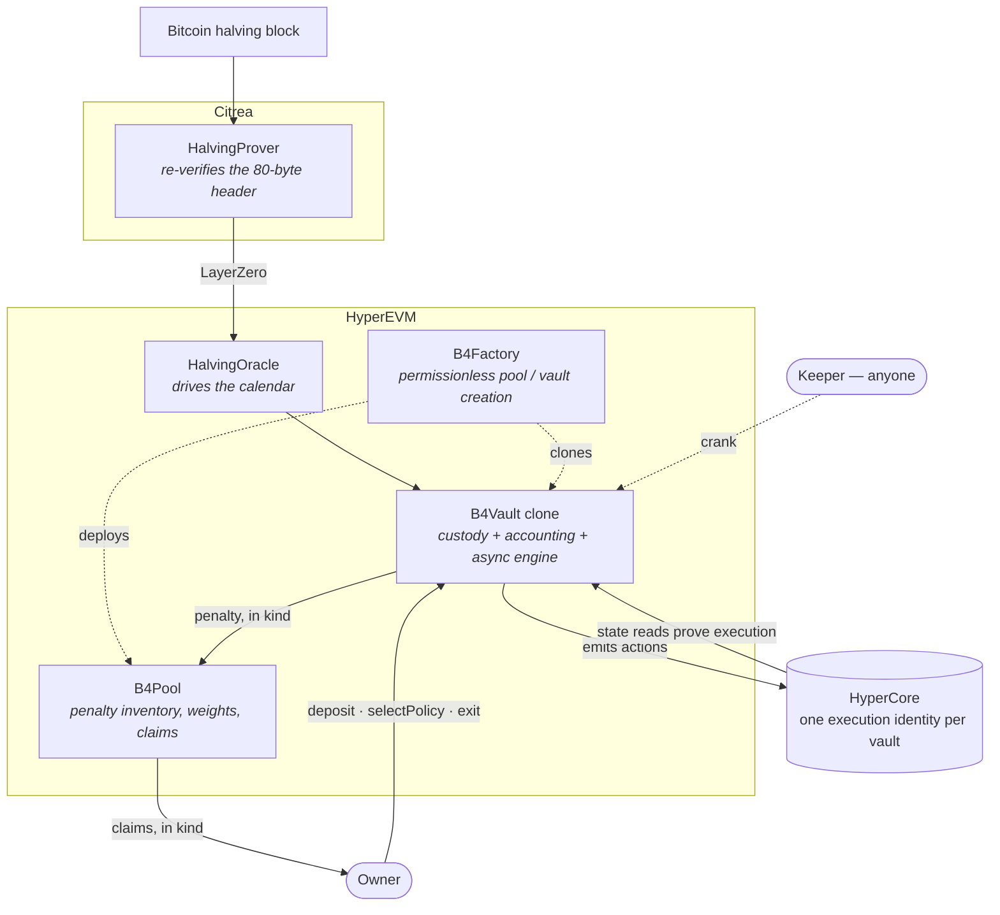

# B4

**Deterministic, non-custodial execution of a Bitcoin-cycle hold strategy — built as a safety
mechanism, not a trading bot.**

A user deposits a directional asset plus canonical USDC into an isolated vault and picks two
target exposures — one for the growth regime, one for the fall regime. Time since the last
proven Bitcoin halving selects and interpolates the active target. One external fact, one
venue (HyperEVM + HyperCore), one accounting model, no admin.

> [!WARNING]
> **Pre-mainnet. Not externally audited. Do not use with real funds.**
> The mandatory funded network gates ([`spec/SECURITY_MODEL.md`](spec/SECURITY_MODEL.md) §5)
> are unmet, and venue semantics cannot be proven off-chain. See [`REPORT.md`](REPORT.md) for
> exactly what is and is not proven.

## What the protocol protects — by construction

The protocol does not guess tops or bottoms. It removes the ways a cycle position dies. Each
protection is **structural** — enforced by code and calendar geometry, not by promises — and
the table marks what is live in the shipped contracts versus specified-and-tested but pending
the leverage-sizing redo (full status: [REPORT.md](REPORT.md)):

| Threat | Structural protection | Status |
|---|---|---|
| Admin/key compromise | **There are no keys.** No upgrade proxy, no pause, no privileged fund mover — nothing for an attacker or insider to take over. | shipped |
| Riding the bear | **The calendar steps aside.** A pure function of time since the proven halving rotates B4/Pro out of the market for the fall regime — the phase where buy-and-hold takes its −76…−84 % cycle drawdown. | shipped |
| Chasing price | **Sized once, then held.** Positions are sized when the calendar rotates and never re-traded against a moving NAV — no volatility drag, no discretionary re-entry. | shipped |
| Stuck execution | **Self-healing by anyone.** Async execution is proven by venue state reads; every step is permissionlessly crankable. Worst reachable state is delayed liveness — never fund loss, never frozen funds. | shipped |
| Exit denial | **The exit cannot be blocked.** Exit liveness depends on no operator, keeper, oracle update or pool interaction; penalties route through guarded one-way paths. | shipped |
| Liquidation by an ordinary swing | **Stops sit at confirmed extremes.** A leveraged position's liquidation is placed by margin size at a price the market already printed and failed to regain — the confirmed low (longs) or peak (shorts) — never a stop order. Verified on every completed cycle: the structural stop was never touched, while a flat-`φ` position is liquidated by the +99–103 % bear rallies (shorts) or the −64 % COVID crash (longs). | **designed** (math + anchors shipped & tested; the vault-engine sizing is flat-`φ` pending the [§7b redo](AUDIT-2026-07-structural-leverage.md)) |

The five shipped protections are what make the benchmark below beat buy-and-hold — **B4, Pro
and Pro Max return a multiple of `HODL` while drawing down materially less**, not by predicting
price but by refusing to hold through the phase that produces the damage. (Mini holds `HODL`'s
exposure by design, so it tracks `HODL`'s drawdown — its edge is the pool, not less risk.) The
structural leverage that makes Pro Max's leverage *survivable* is specified and its math is
tested, but the engine sizes flat-`φ` today — so Pro Max's benchmark leverage is the design
target, not shipped behaviour.

## Documentation

| | |
|---|---|
| **Start here** | [Overview](docs/01-overview.md) → [Core concepts](docs/02-core-concepts.md) |
| **Integrating** | [Integration](docs/04-integration.md) · [Contract map](docs/03-contracts.md) |
| **Auditing** | [Security model](docs/05-security.md) · [`spec/HAZARDS.md`](spec/HAZARDS.md) · [`INVARIANTS.md`](INVARIANTS.md) |
| **Operating** | [Deployment](docs/06-deployment.md) · [Keeper](docs/08-keeper.md) · [Roles](docs/09-roles.md) · [Off-chain stack](docs/10-offchain-architecture.md) |
| **Economics** | [Fees, penalty and the pool](docs/07-fee-routing.md) · [Backtest](docs/11-backtest.md) · [`spec/WHITEPAPER.md`](spec/WHITEPAPER.md) |

Full index: [`docs/README.md`](docs/README.md). The normative specification the
implementation is judged against lives in [`spec/`](spec/) — citations of the form
`HAZARDS A2` or `SPECIFICATION §4` refer to it.

Implementation records: [`ARCHITECTURE.md`](ARCHITECTURE.md) (design decisions) ·
[`REPORT.md`](REPORT.md) (security dossier + audit history) ·
[`SLITHER.md`](SLITHER.md) (static-analysis triage).

## How it works


```mermaid
flowchart TB
    BTC["Bitcoin halving block"]

    subgraph CIT ["Citrea"]
        PROVER["HalvingProver<br/><i>re-verifies the 80-byte header</i>"]
    end

    subgraph HE ["HyperEVM"]
        ORACLE["HalvingOracle<br/><i>drives the calendar</i>"]
        FACTORY["B4Factory<br/><i>permissionless pool / vault creation</i>"]
        VAULT["B4Vault clone<br/><i>custody + accounting + async engine</i>"]
        POOL["B4Pool<br/><i>penalty inventory, weights, claims</i>"]
    end

    CORE[("HyperCore<br/>one execution identity per vault")]
    OWNER(["Owner"])
    KEEPER(["Keeper — anyone"])

    BTC --> PROVER
    PROVER -- "LayerZero" --> ORACLE
    ORACLE --> VAULT
    FACTORY -. clones .-> VAULT
    FACTORY -. deploys .-> POOL
    VAULT -- "emits actions" --> CORE
    CORE -- "state reads prove execution" --> VAULT
    VAULT -- "penalty, in kind" --> POOL
    POOL -- "claims, in kind" --> OWNER
    OWNER -- "deposit · selectPolicy · exit" --> VAULT
    KEEPER -. crank .-> VAULT
```

Three properties define the system:

- **The calendar is a pure function of block time.** Nobody — owner, operator or keeper —
  chooses the regime, the target, the market or the price.
- **Execution is asynchronous and proven, never assumed.** Emitting a CoreWriter action is not
  evidence it executed; the effect must be proven by a later Core state read, and accounting
  credits the *measured balance delta*, never the requested amount. Donations and favourable
  overfills stay unaccounted and separately recoverable.
- **Authority is minimal.** No upgrade proxy, no pause, no privileged fund mover. The worst
  case of any stalled step is delayed liveness, never loss of funds.

## The products

Each product is the previous one plus one more interior move at the two cycle pivots.
`φ = 1.618033988749894848`.

| Product | Growth | Fall | Adds |
|---|---:|---:|---|
| Mini | `1` | `1` | holds spot, trades nothing; earns pool yield |
| B4 | `1` | `0` | a fall-regime rotation into USDC |
| Pro | `1` | `−1` | a full `1×` short in the fall regime |
| Pro Max | `φ` | `−φ` | leveraged expression of the same signs |

A signed target `n` decomposes exactly once, identically for every product:

```
spot = clamp(n, 0, 1)     // directional spot
perp = n − spot           // residual the spot leg cannot express
```

How much accepted holding risk to keep is the user's dial; the protocol takes no directional
view on their behalf.

## The cycle

The two pivots are **not fitted to price history** — they are the golden-ratio self-division
of the interval, so the model carries **zero tuned parameters**. Any other boundary would have
to be calibrated against the handful of completed cycles.

| Pivot | Formula | Share of cycle | Nominal day |
|---|---|---:|---:|
| `P` growth → fall | `cycle/φ²` | 38.20 % | ≈ 557.7 d |
| `T` fall → growth | `cycle/φ` | 61.80 % | ≈ 902.3 d |


```mermaid
flowchart LR
    G["<b>Growth</b><br/>1.47 y"]
    CG["Closing<br/>10 d ✅"]
    S1{{"⚑ Settlement<br/>P−H"}}
    OF["Opening fall<br/>10 d ✅ ⛔"]
    F["<b>Fall</b><br/>0.94 y"]
    CF["Closing<br/>10 d ✅"]
    S2{{"⚑ Settlement<br/>T+H"}}
    OG["Opening growth<br/>10 d ✅ ⛔"]
    TG["<b>Terminal growth</b><br/>1.47 y"]

    G --> CG --> S1 --> OF --> F --> CF --> S2 --> OG --> TG
    TG -. "next halving ⇒ t = 0" .-> G
```

✅ free exit · ⛔ deposits closed · nominal cycle `1460 d`, transitions `W = 20 d`, halves
`H = 10 d`. A sign change always passes through a verified zero at a settlement point;
strictly same-sign pairs interpolate directly and never synthesise one — which is why Mini
never trades, yet is still fee'd on interval profit.

Details: [Core concepts](docs/02-core-concepts.md).

## Benchmark — every product, driven through the real contracts

These numbers are **not** a parallel spreadsheet model. Every figure is `B4Vault.navWad()`
read off the **actual deployed contracts** — real `B4Vault`/`B4VaultOps`/`B4Pool`/
`HalvingOracle` and the reference `Strategy*` — cranked day by day across the real halving
epochs, rotating and settling exactly as the on-chain keeper would. Source:
[`test/backtest/BacktestReal.t.sol`](test/backtest/BacktestReal.t.sol). Reproduce:

```bash
forge test --match-path 'test/backtest/BacktestReal.t.sol' -vv
```

Each vault starts from **$100k of BTC** ("BTC base"). Mini and B4 never short, so they post no
margin. Pro and Pro Max short in the fall and therefore also post USDC **margin** (a short
cannot be backed by the USDC from selling spot — it needs its own margin bucket); that margin
is *additional* capital, reported separately, and the return multiple is taken on the $100k BTC
base so all four products stay comparable.

### Three complete cycles + cycle 4 in progress (2012-11-28 → 2026-07-20)

| Product | Total return (BTC base) | Worst cycle drawdown | Extra margin posted |
|---|---:|---:|---:|
| Mini (spot hold — the baseline) | 4,930x | 84.5 % | — |
| **B4** | **353,850x** | **73.9 %** | — |
| **Pro** | **369,138x** | **73.3 %** | $15k |
| **Pro Max** | **625,543x** | **72.9 %** | $25k |

### Per cycle — return and drawdown side by side

| Cycle | | Mini | B4 | Pro | Pro Max |
|---|---|---:|---:|---:|---:|
| **2012→2016** | return | 51.0x | 137.6x | 143.7x | **231.8x** |
| | max DD | 84.5 % | **73.9 %** | **73.3 %** | **72.9 %** |
| **2016→2020** | return | 13.4x | 52.6x | 52.5x | **55.3x** |
| | max DD | 83.4 % | **64.0 %** | **64.0 %** | **64.1 %** |
| **2020→2024** | return | 7.3x | 29.2x | 29.2x | 29.1x |
| | max DD | 76.8 % | **53.0 %** | **53.0 %** | **53.0 %** |
| **2024→now**\* | return | 0.99x | 1.68x | 1.68x | 1.68x |
| | max DD | 53.7 % | **28.2 %** | **28.2 %** | **28.2 %** |

<sub>\* cycle in progress, read at the last available price date.</sub>

Read the two rows together: **more return, less drawdown.** B4/Pro/Pro Max cut ~10 pp off
Mini's cycle drawdown because they step out of the market (into USDC or a short) during the
bear that produces it. The short's edge is concentrated in cycle 1 — the biggest fall — and
fades in later cycles: with a *fixed* margin, the short's notional shrinks relative to a
compounding NAV, so Pro and B4 converge (a real property the old idealized model hid; scaling
margin with NAV would keep the short's contribution, at the cost of more capital at risk). Mini
holds spot in both regimes and pays only the operator's real cut (≈ 1.72 % of profit), so it
lands just under raw buy-and-hold (~5,200x over the same span) — see
[Pool weight](#pool-weight--not-a-backtestable-number) for what the fee's larger remainder buys.

> [!NOTE]
> **These numbers depend on operational assumptions**, and moving them moves the result: the
> keeper cadence (this run cranks at each calendar transition and the two settlements, not every
> block), the margin a short product posts (more margin → larger short → more fall capture and
> more risk), and — because NAV excludes unrealized PnL by design (engine invariant B3) — the
> exact point at which a short is closed and its gain realized. A held single-vault backtest can
> show the mechanism faithfully; it cannot promise a live keeper reproduces the multiple to the
> digit. An **earlier hand-rolled model** (a parallel equity calculator, now deleted) reported
> e.g. Pro Max 22,542,031x — it applied compounding structural leverage every cycle that the
> shipped flat-`φ` engine never delivers, overstating Pro Max ~36×. This is the corrected,
> contract-sourced replacement.

### The survival record — the safety mechanism, measured

| Event (real data) | Flat-`φ` position | Structural position |
|---|---|---|
| Bear rally +103 % (2015: $152 → $310) | **liquidated** | survives — stop pinned above the confirmed peak |
| Bear rally +99 % (2018: $5,921 → $11,780) | **liquidated** | survives |
| COVID crash −64 % (2020: $13,838 → $4,953) | **liquidated** | survives — stop below the confirmed bottom |
| Every completed cycle, both pivots | — | **the structural stop was never touched** |

After the 38.2 % pivot the price never returned to the confirmed peak (it stayed 1–23 %
below); after the 62 % window it never broke the confirmed bottom (the low stayed +150 %
above the long's stop). The stops are placed where the market has already proven it cannot
go — that is the design, and four cycles of data agree with it.

### Pool weight — not a backtestable number

This section went through two wrong models before landing here — both are recorded below
because the mistakes are instructive about what the pool actually is.

**How a claim is actually earned.** At every settlement, the vault computes `virtualFee = 4.5 %`
of that interval's profit. Only the operator's slice of it (`≤ 38.19 %`, i.e. `≤ ~1.72 %` of
profit) is ever paid out — that's the only amount that leaves your equity, and it's exactly what
the benchmark above deducts. The rest — `≥ 2.79 %` of profit, the **client share** — is *not*
lost: it's added to your vault's `rewardBaseWad`, a running balance that never resets except
when you partially exit (scaled down by what you withdrew). Every settlement, your vault reports
its current `rewardBaseWad` to `B4Pool` as your **weight** for that interval.

**How a claim is paid.** The pool's basket for an interval is whatever exit penalties (`q = 11.8 %`
of a penalized exit's position) landed in it before that interval closed. Distribution is pro
rata by weight: `your_share = bucket × your_weight / total_weight_of_everyone_who_settled_that_interval`.

**Why no multiplier is given here.** Your weight is *your own* accumulated performance-fee
share — it scales with how much dollar profit your vault generates (Pro Max's absolute profit
dwarfs Mini's, so Pro Max earns disproportionately more weight per dollar deposited, not the same
cut everyone else gets). Both the numerator (penalty volume) and the denominator (`total_weight`,
the sum of every *other* participating vault's own weight) depend on who else is using the
protocol at the time — a population this repo has no way to assume without inventing one. A
flat "×1.09" applied equally to every product, which an earlier draft of this section claimed
(and before that, a wrongly-compounded "4–5× yield" — both fabricated, both removed), was simply
not a real number.

What *is* real and code-grounded: the worked settlement/exit examples in
[docs/07-fee-routing.md §6](docs/07-fee-routing.md#6-worked-numeric-example), pinned by
`Settle.t.sol`, `Exit.t.sol`, `V3Acct_SettleBasketFee.t.sol`. The mechanism is real and the
client share is never destroyed — but its dollar payoff is an ecosystem property, not a
strategy property, so it stays out of this benchmark's return figures.

> [!NOTE]
> **Scope of the numbers.** Three completed cycles is not a statistical sample (~32 halvings
> will ever exist); multiples assume entry at the pivots, infinite depth, no slippage/impact/
> trading fees; perps were not liquid before ~2016, so early-cycle Pro/Pro Max are
> hypotheticals; pool income uses the 20 %-exit behavioural assumption. The `StructuralLeverage`
> math and both anchor ratchet concepts are shipped and tested; the vault-engine sizing runs
> flat-`φ` until the §7b redo lands ([audit record](AUDIT-2026-07-structural-leverage.md)).

Method and every omitted cost: [Backtest](docs/11-backtest.md).

## Versioning: no upgrade path, by design

Every contract is immutable — no proxy, no pause, no admin who can reach into a live vault.
Safety comes from correctness by construction plus the owner's exit right, the same model as
Bitcoin and Uniswap V1/V2/V3.

The consequence is explicit: **a fix is a new deployment, not a patch.** A defect in `v1` is
addressed by deploying a re-audited `v2` alongside it; `v1` keeps running exactly as written.
Vaults are clones bound to their implementation and do not migrate automatically — a user
moves by exiting and re-entering, which is free inside a transition window and otherwise costs
the ordinary exit penalty.

## Build & test

Requires [Foundry](https://book.getfoundry.sh/); Solidity `0.8.28` is pinned in `foundry.toml`.

```bash
forge build --sizes   # every contract must fit EIP-170
forge fmt --check
forge test            # unit + integration + invariant campaigns

FOUNDRY_PROFILE=deep forge test --match-path 'test/invariant/*'   # nightly deep profile
slither . --fail-high                                            # release gate, also in CI
```

## Repository layout

```text
src/
  core/       B4Factory · B4Pool · B4Vault (+Storage/Engine/Ops) · HalvingOracle
  venue/      HyperCore types, precompile readers, CoreWriter encoding, descriptors
  libraries/  Phi (fixed point + φ) · Calendar · BtcHeader · SafeTransfer
  periphery/  Keeper · reference strategies
  citrea/     HalvingProver (source-chain publisher)
test/         unit · integration · invariant campaigns · adversarial HyperCore mock
script/       deployment wiring
data/         BTC daily closes used by the historical demo
spec/         the normative specification package
docs/         guides
```

## Security

Report vulnerabilities privately — see [`SECURITY.md`](SECURITY.md). Please do not open a
public issue for a suspected vulnerability.

There is no admin key and no pause, so a live deployment cannot be halted; that is precisely
why pre-deployment reports matter.

## License

[MIT](LICENSE) — matching the SPDX header on every source file.
