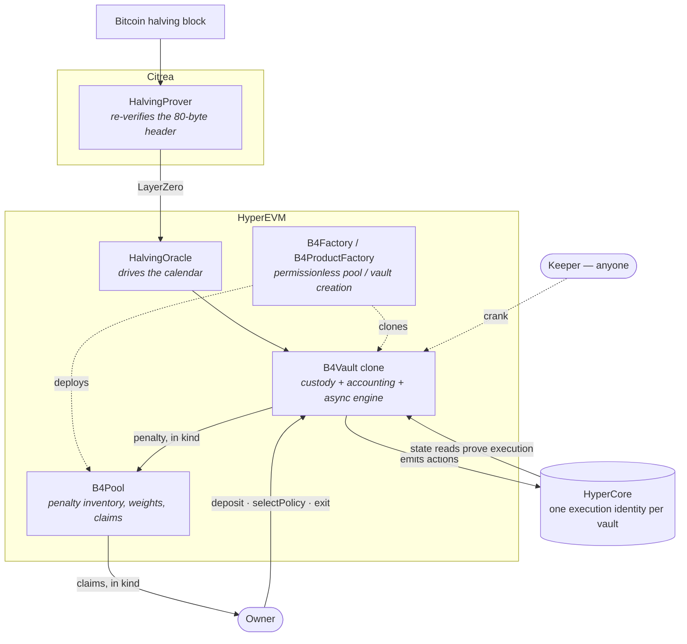
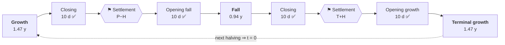

# B4

**Deterministic, non-custodial execution of a Bitcoin-cycle hold strategy — built as a safety
mechanism, not a trading bot.**

A user deposits a directional asset plus canonical USDC into an isolated vault and picks two
target exposures — one for the growth regime, one for the fall regime. Time since the last
proven Bitcoin halving selects and interpolates the active target. One external fact, one
venue (HyperEVM + HyperCore), one accounting model, no admin.

> [!WARNING]
> **Pre-mainnet. Not externally audited. Do not use with real funds.**
> The mandatory funded network gates ([`spec/SECURITY_MODEL.md`](spec/SECURITY_MODEL.md) §5)
> are unmet, and venue semantics cannot be proven off-chain. See [`docs/audits/REGISTRY.md`](docs/audits/REGISTRY.md) for
> exactly what is and is not proven.

## What the protocol protects — by construction

The protocol does not guess tops or bottoms. It removes the ways a cycle position dies. Each
protection is **structural** — enforced by code and calendar geometry, not by promises — and
the table marks what is live in the shipped contracts versus specified-and-tested but pending
the leverage-sizing redo (full status: [`docs/audits/REGISTRY.md`](docs/audits/REGISTRY.md)):

| Threat | Structural protection | Status |
|---|---|---|
| Admin/key compromise | **There are no keys.** No upgrade proxy, no pause, no privileged fund mover — nothing for an attacker or insider to take over. | shipped |
| Riding the bear | **The calendar steps aside.** A pure function of time since the proven halving rotates B4/Pro out of the market for the fall regime — the phase where buy-and-hold takes its −76…−84 % cycle drawdown. | shipped |
| Chasing price | **Sized once, then held.** Positions are sized when the calendar rotates and never re-traded against a moving NAV — no volatility drag, no discretionary re-entry. | shipped |
| Stuck execution | **Self-healing by anyone.** Async execution is proven by venue state reads; every step is permissionlessly crankable, so no step depends on a privileged party showing up. Accounting stays conservative under every stall: nothing is credited that was not measured, so a stuck vault never misprices or mis-pays. **The one case that is not self-healing is bounded, not denied.** If the venue takes a Core→EVM debit and the credit is then permanently lost, the leg can neither complete nor safely resend — resending after a proven debit could send twice (`spec/HAZARDS.md` A7). That capital is gone, and no contract can undo it. What the vault does not do is add itself to the loss: after 30 days the owner calls `abandonStuckReturn`, which writes the books down to what Core actually holds and frees the vault, and a credit arriving later still reaches the owner as recoverable surplus. So the honest claim is: **funds already lost by the venue stay lost; the rest of the vault does not go with them.** Reaching that state at all needs a venue failure the funded gates exist to characterise. | shipped |
| Exit denial | **The exit cannot be blocked.** Exit liveness depends on no operator, keeper, oracle update or pool interaction; penalties route through guarded one-way paths. | shipped |
| Liquidation by an ordinary swing | **Stops sit at confirmed extremes.** A leveraged position's liquidation is placed by margin size at a price the market already printed and failed to regain — the confirmed low (longs) or peak (shorts) — never a stop order. Verified on every completed cycle: the structural stop was never touched, while a flat-`φ` position is liquidated by the +99–103 % bear rallies (shorts) or the −64 % COVID crash (longs). | **shipped** (margin control, both sides — the engine sizes the position so the venue liquidation sits at the structural stop; [state machine](docs/design/STRUCTURAL-STATE-MACHINE.md)) |

The five shipped protections are what make the benchmark below beat buy-and-hold — **B4, Pro
and Pro Max return a multiple of `HODL` while drawing down materially less**, not by predicting
price but by refusing to hold through the phase that produces the damage. (Mini holds `HODL`'s
exposure by design, so it tracks `HODL`'s drawdown — its edge is the pool, not less risk.) The
structural leverage that makes Pro Max's leverage *survivable* is shipped as margin control.
The single-vault benchmark below deliberately does not sample anchor windows, so it exercises
the engine's safe genesis-flat fallback rather than presenting a structural-leverage result.

## Documentation

| | |
|---|---|
| **Start here** | [Overview](docs/01-overview.md) → [Core concepts](docs/02-core-concepts.md) |
| **Integrating** | [Integration](docs/04-integration.md) · [Contract map](docs/03-contracts.md) |
| **Auditing** | [Security model](docs/05-security.md) · [`spec/HAZARDS.md`](spec/HAZARDS.md) · [`INVARIANTS.md`](INVARIANTS.md) |
| **Operating** | [Deployment](docs/06-deployment.md) · [Keeper](docs/08-keeper.md) · [Roles](docs/09-roles.md) · [Off-chain stack](docs/10-offchain-architecture.md) |
| **Economics** | [Fees, penalty and the pool](docs/07-fee-routing.md) · [Backtest and population simulation](docs/11-backtest.md) · [`spec/WHITEPAPER.md`](spec/WHITEPAPER.md) |

Full index: [`docs/README.md`](docs/README.md). The normative specification the
implementation is judged against lives in [`spec/`](spec/) — citations of the form
`HAZARDS A2` or `SPECIFICATION §4` refer to it.

Implementation records: [`ARCHITECTURE.md`](ARCHITECTURE.md) (design decisions) ·
[`docs/audits/REGISTRY.md`](docs/audits/REGISTRY.md) (security dossier + audit history) ·
[`SLITHER.md`](docs/audits/SLITHER.md) (static-analysis triage).

## How it works


```mermaid
flowchart TB
    BTC["Bitcoin halving block"]

    subgraph CIT ["Citrea"]
        PROVER["HalvingProver<br/><i>re-verifies the 80-byte header</i>"]
    end

    subgraph HE ["HyperEVM"]
        ORACLE["HalvingOracle<br/><i>drives the calendar</i>"]
        FACTORY["B4Factory / B4ProductFactory<br/><i>permissionless pool / vault creation</i>"]
        VAULT["B4Vault clone<br/><i>custody + accounting + async engine</i>"]
        POOL["B4Pool<br/><i>penalty inventory, weights, claims</i>"]
    end

    CORE[("HyperCore<br/>one execution identity per vault")]
    OWNER(["Owner"])
    KEEPER(["Keeper — anyone"])

    BTC --> PROVER
    PROVER -- "LayerZero" --> ORACLE
    ORACLE --> VAULT
    FACTORY -. clones .-> VAULT
    FACTORY -. deploys .-> POOL
    VAULT -- "emits actions" --> CORE
    CORE -- "state reads prove execution" --> VAULT
    VAULT -- "penalty, in kind" --> POOL
    POOL -- "claims, in kind" --> OWNER
    OWNER -- "deposit · selectPolicy · exit" --> VAULT
    KEEPER -. crank .-> VAULT
```

Three properties define the system:

- **The calendar is a pure function of block time.** Nobody — owner, operator or keeper —
  chooses the regime, the target, the market or the price.
- **Execution is asynchronous and proven, never assumed.** Emitting a CoreWriter action is not
  evidence it executed; the effect must be proven by a later Core state read, and accounting
  credits the *measured balance delta*, never the requested amount. Donations and favourable
  overfills stay unaccounted and separately recoverable.
- **Authority is minimal.** No upgrade proxy, no pause, no privileged fund mover. The worst
  case of any stalled step is delayed liveness, never loss of funds.

## The products

Each product is the previous one plus one more interior move at the two cycle pivots.
`φ = 1.618033988749894848`.

| Product | Growth | Fall | Adds |
|---|---:|---:|---|
| Mini | `1` | `1` | holds spot, trades nothing; earns pool yield |
| B4 | `1` | `0` | a fall-regime rotation into USDC |
| Pro | `1` | `−1` | a full `1×` short in the fall regime |
| Pro Max | `φ` | `−φ` | leveraged expression of the same signs |

A signed target `n` decomposes exactly once, identically for every product:

```
0 ≤ n ≤ 1:          spot = n,  perp = 0   // unlevered long, held in the asset
|n| > 1 or n < 0:   spot = 0,  perp = n   // leverage/short: a pure, USDC-margined perp
```

How much accepted holding risk to keep is the user's dial; the protocol takes no directional
view on their behalf.

## The cycle

The two pivots are **not fitted to price history** — they are the golden-ratio self-division
of the interval, so the model carries **zero tuned parameters**. Any other boundary would have
to be calibrated against the handful of completed cycles.

| Pivot | Formula | Share of cycle | Nominal day |
|---|---|---:|---:|
| `P` growth → fall | `cycle/φ²` | 38.20 % | ≈ 557.7 d |
| `T` fall → growth | `cycle/φ` | 61.80 % | ≈ 902.3 d |


```mermaid
flowchart LR
    G["<b>Growth</b><br/>1.47 y"]
    CG["Closing<br/>10 d ✅"]
    S1{{"⚑ Settlement<br/>P−H"}}
    OF["Opening fall<br/>10 d ✅"]
    F["<b>Fall</b><br/>0.94 y"]
    CF["Closing<br/>10 d ✅"]
    S2{{"⚑ Settlement<br/>T+H"}}
    OG["Opening growth<br/>10 d ✅"]
    TG["<b>Terminal growth</b><br/>1.47 y"]

    G --> CG --> S1 --> OF --> F --> CF --> S2 --> OG --> TG
    TG -. "next halving ⇒ t = 0" .-> G
```

✅ free exit · nominal cycle `1460 d`, transitions `W = 20 d`, halves `H = 10 d`.
Deposits are accepted throughout: a day-15 entrant starts at the current 50% target and reaches
the full target at day 20. A sign change always passes through a verified zero at a settlement
point; strictly same-sign pairs interpolate directly and never synthesise one — which is why
Mini never trades, yet is still fee'd on interval profit.

Details: [Core concepts](docs/02-core-concepts.md).

## Benchmark — every product, driven through the real contracts

These numbers are **not** a parallel spreadsheet model. Every figure is `B4Vault.navWad()`
read off the **actual deployed contracts** — real `B4Vault`/`B4VaultOps`/`B4Pool`/
`HalvingOracle` and the reference `Strategy*` — cranked day by day across the real halving
epochs, rotating and settling exactly as the on-chain keeper would. Source:
[`test/backtest/BacktestReal.t.sol`](test/backtest/BacktestReal.t.sol). Reproduce:

```bash
forge test --match-path 'test/backtest/BacktestReal.t.sol' -vv
```

Every vault starts from the **same BTC deposit** and posts **no separate margin**: a short
product (Pro / Pro Max) funds its fall short by selling that BTC into USDC and using it as perp
collateral — exactly as it would on-chain. Per cycle, income is **realized**: at each halving the
vault fully exits inside the 20-day penalty-free window (paying the performance fee and realizing
the perp-leg PnL that `navWad` excludes by design, invariant B3), then re-deposits — so the
return is the real, compounded, post-fee value a holder would have taken.

### Three complete cycles + cycle 4 in progress (2012-11-28 → 2026-07-20)

| Product | Total return | vs HODL | Worst cycle drawdown |
|---|---:|---:|---:|
| HODL (raw BTC, no vault, no fee) | 5,261.092x | 1.0× | ~84 % |
| Mini (spot hold — tracks HODL) | 4,813.714x | 0.915× | 84.45 % |
| **B4** | **345,257.166x** | **65.625×** | **73.85 %** |
| **Pro** | **1,317,056.456x** | **250.339×** | **73.85 %** |
| **Pro Max** | **31,753,217.433x** | **6,035.480×** | **1.96 %** |

### Per cycle — realized return and drawdown side by side

| Cycle | | HODL | Mini | B4 | Pro | Pro Max |
|---|---|---:|---:|---:|---:|---:|
| **2012→2016** | return | 52.3x | 50.8x | 137.2x | 230.8x | **660.4x** |
| | max DD | — | 84.45 % | **73.85 %** | **73.85 %** | **0.00 %** |
| **2016→2020** | return | 13.6x | 13.2x | 51.9x | 73.2x | **180.1x** |
| | max DD | — | 83.44 % | **64.04 %** | **64.04 %** | **1.96 %** |
| **2020→2024** | return | 7.3x | 7.1x | 28.6x | 45.8x | **125.1x** |
| | max DD | — | 76.81 % | **53.02 %** | **53.02 %** | **0.73 %** |
| **2024→now**\* | return | 1.01x | 1.00x | 1.70x | 1.70x | **2.13x** |
| | max DD | — | 53.33 % | **28.15 %** | **28.15 %** | **0.00 %** |

<sub>\* cycle in progress: not yet exited, so read as an unrealized `navWad` mark.</sub>

Read the two rows together: **more return, less drawdown.** B4/Pro/Pro Max cut ~10 pp off Mini's
cycle drawdown because they step out of the market (into USDC or a short) during the bear that
produces it. Selling the whole spot position to stand up the short makes Pro a full-size short of
the fall, so it clears B4 by a wide margin (1.317M× vs 345k×); Pro Max adds the `φ` leg on top. The
short's edge is largest in cycle 1 (the deepest fall) and compresses in the shallower later
cycles. Mini holds spot in both regimes and pays only the operator's real cut (≈ 1.72 % of
profit), so it lands just under raw buy-and-hold (~5,200x) — see
[Pool weight](#pool-weight--population-dependent-now-simulated-separately) for what the fee's
larger remainder buys.

> [!NOTE]
> **These numbers depend on operational assumptions**, and moving them moves the result: the
> keeper cadence (this run cranks at each calendar transition, the two settlements, and the
> per-cycle exit — not every block), and the exit timing inside the free window (NAV excludes
> unrealized PnL by design, B3, so *when* a leg is realized matters). A single-vault backtest
> shows the mechanism faithfully; it cannot promise a live keeper reproduces the multiple to the
> digit.
>
> **The [V6-M-2](docs/audits/REGISTRY.md) engine fix that lets the short self-fund passed its
> adversarial fan-out audit ([AUDIT-V7](docs/audits/REGISTRY.md)) with no Critical/High — every
> finding is low and NAV-preserving** (no fund loss, no freeze). Known bounded edges: the
> self-funded position sizes on strategy value net of the carved margin, so it lands a few percent
> under `|perpF|·NAV` at the BTC perp's `maxLev = 40` (more at low `maxLev`); a mixed BTC+USDC
> deposit has a NAV-neutral owner-margin/strategy accounting edge.
>
> **Pro Max is not `φ`-levered for the whole cycle under BTC-only funding.** A leveraged *long*
> needs margin *on top* of 100 % spot, which selling spot cannot provide — so Pro Max runs **1× in
> the growth phase**; its `φ` edge is the fall short (funded by selling spot) and the recovery long
> (funded by the closed short). Its downside is also understated twice: the test venue models **no
> liquidation** (a `φ` leg through a deep drawdown would be liquidated live), and `navWad` excludes
> unrealized perp PnL (B3). The engine uses structural margin control when anchors are confirmed;
> this deliberately unsampled backtest falls back to flat `φ`, so it does not measure that
> confirmed-anchor path.

### The survival record — the safety mechanism, measured

| Event (real data) | Flat-`φ` position | Structural position |
|---|---|---|
| Bear rally +103 % (2015: $152 → $310) | **liquidated** | survives — stop pinned above the confirmed peak |
| Bear rally +99 % (2018: $5,921 → $11,780) | **liquidated** | survives |
| COVID crash −64 % (2020: $13,838 → $4,953) | **liquidated** | survives — stop below the confirmed bottom |
| Every completed cycle, both pivots | — | **the structural stop was never touched** |

After the 38.2 % pivot the price never returned to the confirmed peak (it stayed 1–23 %
below); after the 62 % window it never broke the confirmed bottom (the low stayed +150 %
above the long's stop). The stops are placed where the market has already proven it cannot
go — that is the design, and four cycles of data agree with it.

### Pool weight — population-dependent, now simulated separately

**How a claim is earned.** At every settlement the vault computes `virtualFee = 4.5 %` of that
interval's profit. Only the operator's slice (`≤ 38.19 %`, i.e. `≤ ~1.72 %` of profit) is ever
paid out — the only amount that leaves your equity, and exactly what the benchmark above deducts.
The rest — `≥ 2.79 %` of profit, the **client share** — is *not* lost: it is added to your vault's
`rewardBaseWad`, a running balance that never resets except when you partially exit (scaled by
what you withdrew). Every settlement the vault reports its current `rewardBaseWad` to `B4Pool` as
your **weight** for that interval.

**How a claim is paid.** The pool's basket for an interval is whatever exit penalties (`q = 11.8 %`
of a penalized exit's position) landed in it before that interval closed. Distribution is pro
rata by weight: `your_share = bucket × your_weight / total_weight`, where `total_weight` sums every
vault that settled into that interval.

**Pool choice matters.** The strict product deployment path offers four isolated pools
(Mini/B4/Pro/Pro Max) and one explicit aggregate pool. A non-free penalty is measured in kind,
held by its matching product sleeve, and runs the same engine and structural stop as that
product; it becomes common claim inventory only after the sleeve's free-window exit. Thus Pro
Max cannot silently dilute Mini while either position is live. The precise lifecycle and stop
boundaries are in [Fees, penalty and the pool](docs/07-fee-routing.md#strict-product-pools-carry-the-strategy-with-the-penalty).

**Why no multiplier is given.** Weight is *your own* accumulated performance-fee share — it scales
with your vault's dollar profit (Pro Max's absolute profit dwarfs Mini's, so it earns
disproportionately more weight, not the same cut). Both the numerator (penalty volume) and the
denominator (every *other* participating vault's weight) depend on who else uses the protocol at
the time. The [closed-population runner](docs/11-backtest.md#pool-return--a-closed-population-not-an-assumed-apy)
uses the exact `escrow → sleeve → free-window exit → advance → reportWeight → claimFor` path
for isolated Mini/B4/Pro/Pro Max scenarios and a contract-verified 20% example. An aggregate
result additionally needs the user's chosen product mix; it is not a universal strategy
multiple. The code-grounded numbers are the worked settlement/exit examples in
[docs/07-fee-routing.md §6](docs/07-fee-routing.md#6-worked-numeric-example), pinned by
`Settle.t.sol`, `Exit.t.sol`, `V3Acct_SettleBasketFee.t.sol`.

> [!NOTE]
> **Scope of the numbers.** Three completed cycles is not a statistical sample (~32 halvings
> will ever exist); multiples assume entry at the pivots, infinite depth, no slippage/impact/
> trading fees; perps were not liquid before ~2016, so early-cycle Pro/Pro Max are
> hypotheticals; the population simulation's pool income uses explicit 10% / 20% behavioural
> assumptions. The `StructuralLeverage` math, both anchor ratchets and the vault-engine margin
> control are shipped and tested; this benchmark's lack of anchor samples is why it uses its
> documented flat-`φ` fallback.

Method and every omitted cost: [Backtest](docs/11-backtest.md).

## Versioning: no upgrade path, by design

Every contract is immutable — no proxy, no pause, no admin who can reach into a live vault.
Safety comes from correctness by construction plus the owner's exit right, the same model as
Bitcoin and Uniswap V1/V2/V3.

The consequence is explicit: **a fix is a new deployment, not a patch.** A defect in `v1` is
addressed by deploying a re-audited `v2` alongside it; `v1` keeps running exactly as written.
Vaults are clones bound to their implementation and do not migrate automatically — a user
moves by exiting and re-entering, which is free inside a transition window and otherwise costs
the ordinary exit penalty.

## Build & test

Requires [Foundry](https://book.getfoundry.sh/); Solidity `0.8.28` is pinned in `foundry.toml`.

```bash
forge build --sizes   # every contract must fit EIP-170
forge fmt --check
forge test            # unit + integration + invariant campaigns

FOUNDRY_PROFILE=deep forge test --match-path 'test/invariant/*'   # nightly deep profile
slither . --fail-high                                            # release gate, also in CI
```

## Repository layout

```text
src/
  core/       B4Factory · B4ProductFactory · B4Pool · B4Vault (+Storage/Engine/Ops) · HalvingOracle
  venue/      HyperCore types, precompile readers, CoreWriter encoding, descriptors
  libraries/  Phi (fixed point + φ) · Calendar · BtcHeader · SafeTransfer
  periphery/  Keeper · reference strategies
  citrea/     HalvingProver (source-chain publisher)
test/         unit · integration · invariant campaigns · adversarial HyperCore mock
script/       deployment wiring
data/         BTC daily closes used by the historical demo
spec/         the normative specification package — the SINGLE source of MUST/MUST NOT
docs/         guides, plus the audit (docs/audits/) and design (docs/design/) record
```

`spec/` is normative and `ARCHITECTURE.md` is normative for the implementation (`HAZARDS` G3);
everything under `docs/` explains rather than binds. The specification began life as a
standalone clean-room package one directory up, which for a while left a second, unversioned,
byte-identical copy of all six documents beside the repository — two sets that could only drift
apart, with only one of them the code was judged against. There is now one copy, here. The
prompt the build was handed over on is kept as provenance at
[`docs/design/CLEANROOM-HANDOFF.md`](docs/design/CLEANROOM-HANDOFF.md); it records *why* the code
is shaped the way it is, chiefly that `spec/HAZARDS.md` is binding design input and not
background reading.

## Security

Report vulnerabilities privately — see [`SECURITY.md`](SECURITY.md). Please do not open a
public issue for a suspected vulnerability.

There is no admin key and no pause, so a live deployment cannot be halted; that is precisely
why pre-deployment reports matter.

## License

[MIT](LICENSE) — matching the SPDX header on every source file.
