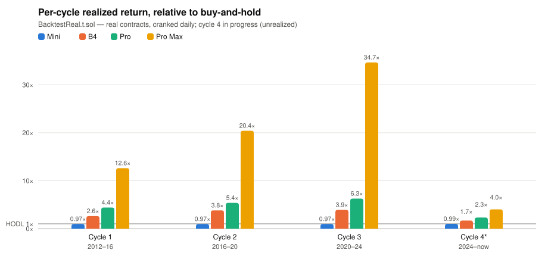
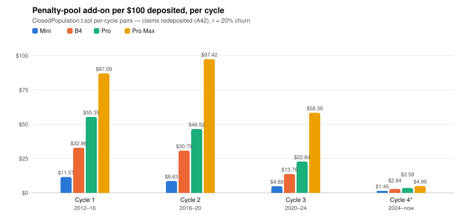
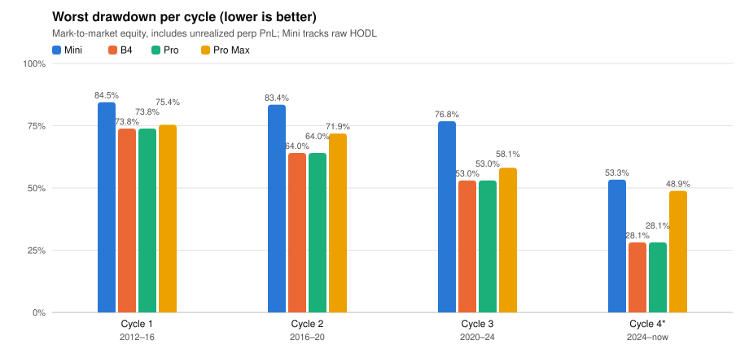
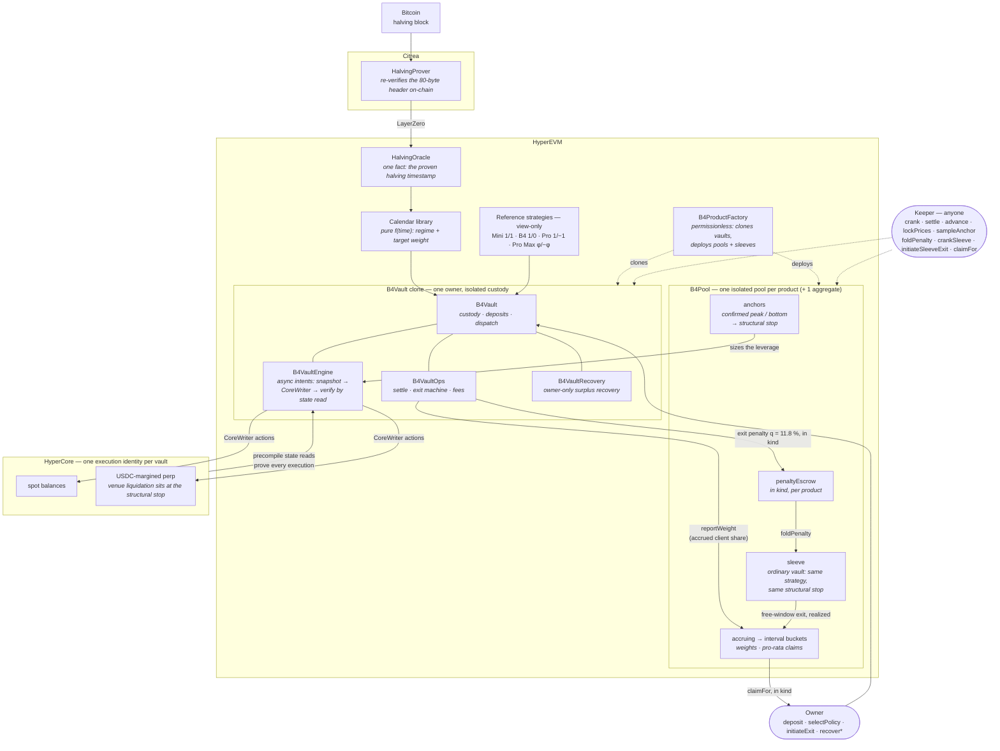
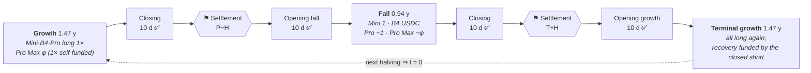

# B4

**Deterministic, non-custodial execution of a Bitcoin-cycle hold strategy — built as a safety
mechanism, not a trading bot.**

A user deposits a directional asset plus canonical USDC into an isolated vault and picks two
target exposures — one for the growth regime, one for the fall regime. Time since the last
proven Bitcoin halving selects and interpolates the active target. One external fact, one
venue (HyperEVM + HyperCore), one accounting model, no admin.

> [!WARNING]
> **Pre-mainnet. Not externally audited. Do not use with real funds.**
> The mandatory funded network gates ([`spec/SECURITY_MODEL.md`](spec/SECURITY_MODEL.md) §5)
> are unmet, and venue semantics cannot be proven off-chain. See [`docs/audits/REGISTRY.md`](docs/audits/REGISTRY.md) for
> exactly what is and is not proven.

## Benchmark — per cycle, pool included, through the real contracts

Every figure is read off the **actual deployed contracts** — real `B4Vault`/`B4VaultOps`/
`B4Pool`/`HalvingOracle` and the reference `Strategy*` — cranked day by day across the real
halving epochs, exactly as the permissionless keeper would. **One basis, no mixing:** ten equal
daily depositors per product in that product's **isolated pool**, `r = 20 %` of them exiting
daily (the churn that funds the penalty pool); each cycle is entered at its halving, measured
mark-to-market at the next, and pool claims are redeposited into the participant's own vault on
receipt. A short product funds its fall short by selling its BTC into USDC perp collateral —
exactly as on-chain.

### What $100 deposited in a cycle becomes

Each cell: what the $100 becomes with everything included; **in parentheses — the part earned
by the penalty pool alone, in dollars per $100** (the rest is the strategy itself).

| Per $100, DCA'd through the cycle — result (of which penalty pool, $) | Cycle 1 | Cycle 2 | Cycle 3 | Cycle 4* |
|---|---:|---:|---:|---:|
| HODL (same flow, raw BTC, no pool) | ×5.29 | ×3.60 | ×2.61 | ×0.81 |
| **Mini** | **×5.34** ($11.57) | **×3.64** ($8.63) | **×2.65** ($4.88) | **×0.82** ($1.45) |
| B4 | ×12.54 ($32.86) | ×13.32 ($30.79) | ×6.54 ($13.76) | ×1.24 ($2.84) |
| Pro | ×20.13 ($55.35) | ×19.87 ($46.52) | ×9.57 ($22.84) | ×1.68 ($3.58) |
| **Pro Max** | **×44.94** ($87.09) | **×65.94** ($97.42) | **×32.47** ($58.39) | **×2.36** ($4.99) |

<sub>\* cycle in progress: an unrealized mark-to-market reading.</sub>

<picture>
  <source media="(prefers-color-scheme: dark)" srcset="docs/assets/benchmark-returns-dark.svg">
  
</picture>

<picture>
  <source media="(prefers-color-scheme: dark)" srcset="docs/assets/benchmark-pool-dark.svg">
  
</picture>

- **Mini with the pool beats holding raw BTC in every one of the four cycles** — the strategy
  alone tracks HODL minus the fee; the pool is what puts it ahead. That is the reason Mini
  exists.
- **The pool's income rises with strategy strength in every cycle** — a stronger strategy earns
  more weight (weight scales with your dollar profit) and its sleeve realizes more into the
  basket ([pinned monotone](test/backtest/PoolYieldDiag.t.sol)).
- No universal number exists: penalty volume and every other participant's weight depend on who
  else uses that product's pool — the churn rate is an explicit input, not a market fact.

### Drawdown per cycle — the safety mechanism (lower is better)

Worst peak-to-trough of **mark-to-market equity** inside each cycle, measured on the strategy
path ([`BacktestReal.t.sol`](test/backtest/BacktestReal.t.sol)):

| Worst drawdown | Cycle 1 | Cycle 2 | Cycle 3 | Cycle 4* |
|---|---:|---:|---:|---:|
| Mini (tracks HODL) | 84.45 % | 83.44 % | 76.81 % | 53.33 % |
| **B4** | **73.85 %** | **64.04 %** | **53.02 %** | **28.15 %** |
| **Pro** | **73.85 %** | **64.04 %** | **53.02 %** | **28.15 %** |
| Pro Max | 75.40 % | 71.86 % | 58.11 % | 48.86 % |

<picture>
  <source media="(prefers-color-scheme: dark)" srcset="docs/assets/benchmark-drawdown-dark.svg">
  
</picture>

- **Mini sets its worst drawdown inside the fall zone in all four cycles; B4, Pro and Pro Max
  never do, in any cycle.** They are in USDC or short there — what remains for them is intra-bull
  volatility that gives back accumulated *profit*, not principal, 4–25 pp under Mini's bear.
- The leverage is survivable by construction: the structural stop sits at a confirmed extreme
  the market printed and failed to regain, and across every completed cycle it was **never
  touched** — while a flat-`φ` position is liquidated three times inside the same window
  (2015 +103 %, 2018 +99 %, 2020 −64 %). Full reconstruction:
  [the survival record](docs/11-backtest.md#the-survival-record--structural-sizing-separate-from-this-fallback-benchmark).

<sub>Charts are generated from the tables on this page by
[`docs/assets/gen_charts.py`](docs/assets/gen_charts.py); regenerate with
`python3 docs/assets/gen_charts.py`. Reproduce the numbers:
`forge test --match-test 'test_closed_population_r20_(mini|b4|pro|promax)_percycle' -vv` and
`forge test --match-path 'test/backtest/BacktestReal.t.sol' -vv`.</sub>

> [!NOTE]
> Three completed cycles is not a statistical sample (~32 halvings will ever exist); no
> slippage/impact/trading fees; perps were illiquid before ~2016, so early-cycle Pro/Pro Max
> are hypotheticals; the `r = 20 %` churn is an explicit input. Under BTC-only funding Pro Max
> runs 1× in the growth phase — its `φ` edge is the fall short and the recovery long. The venue
> mock does not liquidate: the structural stop covers the historical record, a future cycle
> breaking a confirmed extreme is the open tail. Held continuously for all 13.6 years, Mini is
> 0.97× same-flow HODL — the per-cycle win belongs to capital present in that cycle. Full
> method, conventions and every omitted cost: [Backtest](docs/11-backtest.md).

## What the protocol protects — by construction

The protocol does not guess tops or bottoms. It removes the ways a cycle position dies. Each
protection is **structural** — enforced by code and calendar geometry, not by promises (full
status: [`docs/audits/REGISTRY.md`](docs/audits/REGISTRY.md)):

| Threat | Structural protection | Status |
|---|---|---|
| Admin/key compromise | **There are no keys.** No upgrade proxy, no pause, no privileged fund mover — nothing for an attacker or insider to take over. | shipped |
| Riding the bear | **The calendar steps aside.** A pure function of time since the proven halving rotates B4/Pro out of the market for the fall regime — the phase where buy-and-hold takes its −76…−84 % cycle drawdown. | shipped |
| Chasing price | **Sized once, then held.** Positions are sized when the calendar rotates and never re-traded against a moving NAV — no volatility drag, no discretionary re-entry. | shipped |
| Stuck execution | **Self-healing by anyone.** Async execution is proven by venue state reads; every step is permissionlessly crankable, so no step depends on a privileged party showing up. Accounting stays conservative under every stall: nothing is credited that was not measured, so a stuck vault never misprices or mis-pays. **The one case that is not self-healing is bounded, not denied.** If the venue takes a Core→EVM debit and the credit is then permanently lost, the leg can neither complete nor safely resend — resending after a proven debit could send twice (`spec/HAZARDS.md` A7). That capital is gone, and no contract can undo it. What the vault does not do is add itself to the loss: after 30 days the owner calls `abandonStuckReturn`, which writes the books down to what Core actually holds and frees the vault, and a credit arriving later still reaches the owner as recoverable surplus. So the honest claim is: **funds already lost by the venue stay lost; the rest of the vault does not go with them.** | shipped |
| Exit denial | **The exit cannot be blocked.** Exit liveness depends on no operator, keeper, oracle update or pool interaction; penalties route through guarded one-way paths. | shipped |
| Liquidation by an ordinary swing | **Stops sit at confirmed extremes.** A leveraged position's liquidation is placed by margin size at a price the market already printed and failed to regain — the confirmed low (longs) or peak (shorts) — never a stop order. | **shipped** (margin control, both sides; [state machine](docs/design/STRUCTURAL-STATE-MACHINE.md)) |

These protections are what make the benchmark above beat buy-and-hold — **B4, Pro and Pro Max
return a multiple of `HODL` while drawing down materially less**, not by predicting price but by
refusing to hold through the phase that produces the damage. Mini holds `HODL`'s exposure by
design — its edge is the penalty pool, which puts it past buy-and-hold in every measured cycle.

## How it works


```mermaid
flowchart TB
    BTC["Bitcoin<br/>halving block"]

    subgraph CIT ["Citrea"]
        PROVER["HalvingProver<br/><i>re-verifies the 80-byte header on-chain</i>"]
    end

    subgraph HE ["HyperEVM"]
        ORACLE["HalvingOracle<br/><i>one fact: the proven halving timestamp</i>"]
        CAL["Calendar library<br/><i>pure f(time): regime + target weight</i>"]
        STRAT["Reference strategies — view-only<br/>Mini 1/1 · B4 1/0 · Pro 1/−1 · Pro Max φ/−φ"]
        FACTORY["B4ProductFactory<br/><i>permissionless: clones vaults,<br/>deploys pools + sleeves</i>"]

        subgraph VAULT ["B4Vault clone — one owner, isolated custody"]
            V["B4Vault<br/><i>custody · deposits · dispatch</i>"]
            ENG["B4VaultEngine<br/><i>async intents: snapshot →<br/>CoreWriter → verify by state read</i>"]
            OPS["B4VaultOps<br/><i>settle · exit machine · fees</i>"]
            REC["B4VaultRecovery<br/><i>owner-only surplus recovery</i>"]
        end

        subgraph POOL ["B4Pool — one isolated pool per product (+ 1 aggregate)"]
            ESC["penaltyEscrow<br/><i>in kind, per product</i>"]
            SLV["sleeve<br/><i>ordinary vault: same strategy,<br/>same structural stop</i>"]
            BKT["accruing → interval buckets<br/><i>weights · pro-rata claims</i>"]
            ANCH["anchors<br/><i>confirmed peak / bottom<br/>→ structural stop</i>"]
        end
    end

    subgraph CORE ["HyperCore — one execution identity per vault"]
        SPOT["spot balances"]
        PERP["USDC-margined perp<br/><i>venue liquidation sits at the structural stop</i>"]
    end

    OWNER(["Owner<br/>deposit · selectPolicy · initiateExit · recover*"])
    KEEPER(["Keeper — anyone<br/>crank · settle · advance · lockPrices · sampleAnchor<br/>foldPenalty · crankSleeve · initiateSleeveExit · claimFor"])

    BTC --> PROVER
    PROVER -- "LayerZero" --> ORACLE
    ORACLE --> CAL
    CAL --> V
    STRAT --> V
    FACTORY -. "clones" .-> VAULT
    FACTORY -. "deploys" .-> POOL
    V --- ENG
    V --- OPS
    V --- REC
    ENG -- "CoreWriter actions" --> SPOT
    ENG -- "CoreWriter actions" --> PERP
    CORE -- "precompile state reads<br/>prove every execution" --> ENG
    ANCH -- "sizes the leverage" --> ENG
    OPS -- "reportWeight<br/>(accrued client share)" --> BKT
    OPS -- "exit penalty q = 11.8 %, in kind" --> ESC
    ESC -- "foldPenalty" --> SLV
    SLV -- "free-window exit, realized" --> BKT
    BKT -- "claimFor, in kind" --> OWNER
    OWNER --> V
    KEEPER -.-> VAULT
    KEEPER -.-> POOL
```

Three properties define the system:

- **The calendar is a pure function of block time.** Nobody — owner, operator or keeper —
  chooses the regime, the target, the market or the price.
- **Execution is asynchronous and proven, never assumed.** Emitting a CoreWriter action is not
  evidence it executed; the effect must be proven by a later Core state read, and accounting
  credits the *measured balance delta*, never the requested amount. Donations and favourable
  overfills stay unaccounted and separately recoverable.
- **Authority is minimal.** No upgrade proxy, no pause, no privileged fund mover. The worst
  case of any stalled step is delayed liveness, never loss of funds.

## The products

Each product is the previous one plus one more interior move at the two cycle pivots.
`φ = 1.618033988749894848`.

| Product | Growth | Fall | Adds |
|---|---:|---:|---|
| Mini | `1` | `1` | holds spot, trades nothing; earns pool yield |
| B4 | `1` | `0` | a fall-regime rotation into USDC |
| Pro | `1` | `−1` | a full `1×` short in the fall regime |
| Pro Max | `φ` | `−φ` | leveraged expression of the same signs |

A signed target `n` decomposes exactly once, identically for every product:

```
0 ≤ n ≤ 1:          spot = n,  perp = 0   // unlevered long, held in the asset
|n| > 1 or n < 0:   spot = 0,  perp = n   // leverage/short: a pure, USDC-margined perp
```

How much accepted holding risk to keep is the user's dial; the protocol takes no directional
view on their behalf.

## The cycle

The two pivots are **not fitted to price history** — they are the golden-ratio self-division
of the interval, so the model carries **zero tuned parameters**. Any other boundary would have
to be calibrated against the handful of completed cycles.

| Pivot | Formula | Share of cycle | Nominal day |
|---|---|---:|---:|
| `P` growth → fall | `cycle/φ²` | 38.20 % | ≈ 557.7 d |
| `T` fall → growth | `cycle/φ` | 61.80 % | ≈ 902.3 d |


```mermaid
flowchart LR
    G["<b>Growth</b> 1.47 y<br/><i>Mini·B4·Pro long 1×<br/>Pro Max φ (1× self-funded)</i>"]
    CG["Closing<br/>10 d ✅"]
    S1{{"⚑ Settlement<br/>P−H"}}
    OF["Opening fall<br/>10 d ✅"]
    F["<b>Fall</b> 0.94 y<br/><i>Mini 1 · B4 USDC<br/>Pro −1 · Pro Max −φ</i>"]
    CF["Closing<br/>10 d ✅"]
    S2{{"⚑ Settlement<br/>T+H"}}
    OG["Opening growth<br/>10 d ✅"]
    TG["<b>Terminal growth</b> 1.47 y<br/><i>all long again;<br/>recovery funded by the closed short</i>"]

    G --> CG --> S1 --> OF --> F --> CF --> S2 --> OG --> TG
    TG -. "next halving ⇒ t = 0" .-> G
```

✅ free exit · nominal cycle `1460 d`, transitions `W = 20 d`, halves `H = 10 d`.
Deposits are accepted throughout: a day-15 entrant starts at the current 50% target and reaches
the full target at day 20. A sign change always passes through a verified zero at a settlement
point; strictly same-sign pairs interpolate directly and never synthesise one — which is why
Mini never trades, yet is still fee'd on interval profit.

Details: [Core concepts](docs/02-core-concepts.md).

## The penalty pool — where the added income comes from

- **Your weight.** The `4.5 %` virtual fee on interval profit splits into the operator's slice
  (`≤ 38.19 %`, ≈ 1.72 % of profit — the only amount that ever leaves your equity) and the
  **client share** (`≥ 2.79 %` of profit), which accrues to your vault's `rewardBaseWad` and is
  reported to the pool at every settlement.
- **The basket.** Exit penalties (`q = 11.8 %` of a penalized exit's position, in kind) from the
  same product's leavers, worked by that product's own sleeve until a free window realizes them;
  distribution is pro rata by weight.
- **Isolated by product.** Penalty income distributes only within the same strategy — Pro Max
  cannot dilute Mini. The aggregate pool ships with **no published numbers** (its result depends
  on the participant product mix).

Lifecycle and worked examples:
[Fees, penalty and the pool](docs/07-fee-routing.md#strict-product-pools-carry-the-strategy-with-the-penalty) ·
method, full-history reference values and the audit trail:
[Backtest](docs/11-backtest.md#pool-return--a-closed-population-not-an-assumed-apy).

## Documentation

| | |
|---|---|
| **Start here** | [Overview](docs/01-overview.md) → [Core concepts](docs/02-core-concepts.md) |
| **Integrating** | [Integration](docs/04-integration.md) · [Contract map](docs/03-contracts.md) |
| **Auditing** | [Security model](docs/05-security.md) · [`spec/HAZARDS.md`](spec/HAZARDS.md) · [`INVARIANTS.md`](INVARIANTS.md) |
| **Operating** | [Deployment](docs/06-deployment.md) · [Keeper](docs/08-keeper.md) · [Roles](docs/09-roles.md) · [Off-chain stack](docs/10-offchain-architecture.md) |
| **Economics** | [Fees, penalty and the pool](docs/07-fee-routing.md) · [Backtest and population simulation](docs/11-backtest.md) · [`spec/WHITEPAPER.md`](spec/WHITEPAPER.md) |

Full index: [`docs/README.md`](docs/README.md). The normative specification the
implementation is judged against lives in [`spec/`](spec/) — citations of the form
`HAZARDS A2` or `SPECIFICATION §4` refer to it. Implementation records:
[`ARCHITECTURE.md`](ARCHITECTURE.md) (design decisions) ·
[`docs/audits/REGISTRY.md`](docs/audits/REGISTRY.md) (security dossier + audit history) ·
[`SLITHER.md`](docs/audits/SLITHER.md) (static-analysis triage).

## Versioning: no upgrade path, by design

Every contract is immutable — no proxy, no pause, no admin who can reach into a live vault; the
same model as Bitcoin and Uniswap V1/V2/V3. **A fix is a new deployment, not a patch**: `v1`
keeps running exactly as written, and a user moves by exiting (free inside a transition window)
and re-entering.

## Build & test

Requires [Foundry](https://book.getfoundry.sh/); Solidity `0.8.28` is pinned in `foundry.toml`.

```bash
forge build --sizes   # every contract must fit EIP-170
forge fmt --check
forge test            # unit + integration + invariant campaigns

FOUNDRY_PROFILE=deep forge test --match-path 'test/invariant/*'   # nightly deep profile
slither . --fail-high                                            # release gate, also in CI
```

## Repository layout

```text
src/
  core/       B4Factory · B4ProductFactory · B4Pool · B4Vault (+Storage/Engine/Ops) · HalvingOracle
  venue/      HyperCore types, precompile readers, CoreWriter encoding, descriptors
  libraries/  Phi (fixed point + φ) · Calendar · BtcHeader · SafeTransfer
  periphery/  Keeper · reference strategies
  citrea/     HalvingProver (source-chain publisher)
test/         unit · integration · invariant campaigns · adversarial HyperCore mock
script/       deployment wiring
data/         BTC daily closes used by the historical demo
spec/         the normative specification package — the SINGLE source of MUST/MUST NOT
docs/         guides, plus the audit (docs/audits/), design (docs/design/) and benchmark-chart (docs/assets/) record
```

`spec/` is normative and `ARCHITECTURE.md` is normative for the implementation (`HAZARDS` G3);
everything under `docs/` explains rather than binds. `spec/HAZARDS.md` is binding design input,
not background reading — it states so itself, and it is why the async surface is shaped the way
it is.

## Security

Report vulnerabilities privately — see [`SECURITY.md`](SECURITY.md). Please do not open a
public issue for a suspected vulnerability.

There is no admin key and no pause, so a live deployment cannot be halted; that is precisely
why pre-deployment reports matter.

## License

[MIT](LICENSE) — matching the SPDX header on every source file.
