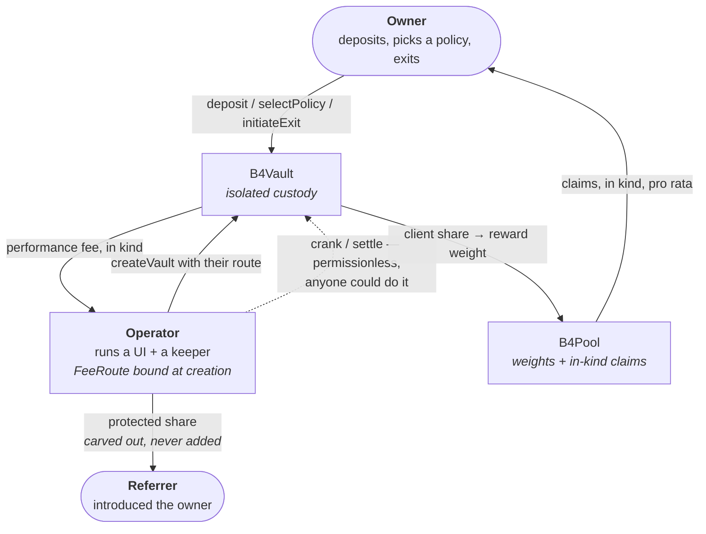

# Roles: who does what, who waits, and who earns

Who can act on a B4 vault, what each party's flow looks like, and where the incentive to keep
the machine running actually comes from.

> Status: B4 is **pre-mainnet and not externally audited**. Venue semantics are not locally
> provable and remain funded release gates — see [`../spec/SECURITY_MODEL.md`](../spec/SECURITY_MODEL.md) §5.

## The four roles at a glance

| Role | Appointed how | Earns | Can move funds? |
|---|---|---|---|
| **Owner** (user) | creates the vault; fixed forever | their own P&L, plus pool claims | only their **own** vault, to themselves |
| **Operator** | their `FeeRoute` is baked in at vault creation | a share of the performance fee, in kind | **no** |
| **Referrer** | set with the operator at creation | a protected share carved out of the operator's payment | **no** |
| **Keeper** | nobody — anyone may call | nothing directly | **no** |

There is no protocol admin, no deployer tax, and no governance. The fee route is validated
once at creation and is **immutable** — no setter exists anywhere in the ABI.



## Owner — the only party with authority over the capital

The owner is fixed at creation (`msg.sender` of `createVault`) and can never be changed or
reached by anyone else. Every `onlyOwner` power acts on **that vault only** and pays **that
vault's owner only**.

**Flow**

1. Pick a pool and one of its directional asset descriptors — usually through an operator's
   interface, which supplies its own `FeeRoute`.
2. `createVault(pool, descriptorHash, strategy, scaleWad, slippageBps, route)` — the strategy's
   `(growth, fall)` targets are read **once** and stored; the route is validated and frozen.
3. `deposit(dirAmount, usdcAmount)` — accepted only while the calendar deposit window is open
   (closed in the two `0 → target` sub-windows) and while no exit is pending.
4. Wait. Execution is asynchronous and driven by `crank()` — see below.
5. Optionally `selectPolicy(strategy, scaleWad)` to change product or scale. This **rebalances
   in place**; it is never an exit and never triggers a penalty. Rejected while an exit is open.
6. `initiateExit(shareWad)` when leaving. This only *arms* the exit; permissionless cranks
   drive it, flattening the position to raw zero and returning all Core principal before any
   proportional payment.

**Economics** — the owner pays a performance fee of `f ≈ 4.508497%` **of interval profit only**
(no management fee, no fee on principal, nothing on a losing interval), and, if exiting outside
a free window, one in-kind penalty `q ≈ 11.803399%` of the exiting gross. In return they accrue
reward weight, which pays out as pool inventory in kind.

**Cannot** — change the fee route, touch another vault, choose the halving fact, or influence
the target: the calendar decides the regime, not the owner.

## Operator — provides the interface, and is paid to keep it alive

An operator is anyone who stands up a frontend/keeper and puts their own address in the
`FeeRoute` of the vaults created through it. They earn on **those vaults only**; there is no
protocol-level tax, and a second operator's vaults are entirely separate.

**Flow**

1. Run an interface that calls `createVault` with `route = { operator, operatorBps, referrer,
   referrerBps }`.
2. Run a keeper — `Keeper.crank(pool, vaults, maxVaultSteps)` — advancing the calendar, locking
   checkpoint prices, sweeping, capturing, cranking each vault's async intents, calling
   `settle`, and claiming pool inventory for owners.
3. Get paid automatically, in kind, at each settlement and at exit. There is no invoice and no
   claim step: `_payOperatorInKind` transfers during `settle`.

**Economics** — `operatorBps` is capped at `3819` (38.19%) of the virtual fee, i.e. at most
**≈ 1.72% of interval profit**. The remainder — at least 61.81% of the fee — is the client
share that becomes pool reward weight. At exit the operator's proportional cut is **carved out
of the penalty**, never added to it.

**Why the operator cranks — the incentive is structural, not a subsidy.** Settlement is what
pays the operator, and settlement only happens if someone cranks:

```
no crank → no settle → no fee reported → operator earns nothing
```

Worse for a lazy operator: `settle` is only valid inside its report window, so a missed window
forfeits that interval's fee entirely and the client weight with it. The party best placed to
crank is exactly the party paid for it. That is why the protocol ships no keeper subsidy and
no bounty — it does not need one, and a keeper reward paid from user funds would be a worse
trade for the owner.

Note also that cranking is **permissionless**: if an operator goes dark, the owner, another
operator, or any third party can crank the same vault. The operator has a monopoly on *their
fee*, never on *liveness*.

**Cannot** — move funds, choose targets, markets, prices, slippage or recipients, change the
route, or block an exit. Every call an operator makes is one anybody else could make.

## Referrer — a protected share of the operator's payment

A referrer is optional and, when present, is bound at creation together with the operator.

**Economics** — `referrerBps` is taken **out of the operator's payment**, never stacked on top:

```solidity
refShare = bps(operatorPayment, referrerBps);   // referrer
operator = operatorPayment - refShare;          // operator keeps the rest
```

The owner therefore pays exactly the same whether or not a referrer exists. The protocol
enforces a **protected minimum** of `3819` bps (38.19%) — a referrer cannot be written into a
route and then given a token share — and a referrer requires a non-zero `operatorBps` to
attach to. Setting `referrerBps` with no referrer, or a referrer with a zero operator rate,
reverts `BadRoute` at creation.

**Cannot** — anything else. The referrer is a payee address; it has no calls.

## Keeper — anyone, no privilege, no reward

`Keeper` is a stateless helper contract holding no funds. Every call it makes is a
permissionless liveness step, so a keeper cannot choose targets, markets, prices, directions or
recipients. In practice the keeper is usually the operator, for the reason above — but the role
is open, and any owner can self-crank if no one else does.

Payouts to a failing recipient are never allowed to block anyone: a transfer that reverts is
recorded as a deferred payout and retried permissionlessly via `claimDeferred`.

## Where each party waits

Asynchronous execution means "submitted" is never "done". What each role is actually waiting on:

| Party | Waits for | Worst case |
|---|---|---|
| Owner (funding/rotation) | a crank to create the intent, then a later crank to prove it on Core | delayed liveness — the step stays callable by anyone, funds are never lost |
| Owner (exit) | cranks to flatten to raw zero and return all Core principal | payment only after principal is home; partial fills resubmit |
| Operator | the settlement point, then the report window | a missed window forfeits that interval's fee |
| Pool claimant | `reportDeadline` to pass | unclaimed inventory sweeps forward into the next interval, not lost |

The design bound is the same everywhere: **the worst case of any stalled step is delayed
liveness, never loss of funds.**

## Further reading

- [Fees, penalty and the pool](07-fee-routing.md) — the exact arithmetic, with a worked example
- [Keeper operations](08-keeper.md) — what to run, and how often
- [Integration](04-integration.md) — the signatures behind every flow above
- [`../REPORT.md`](../REPORT.md) — status dossier and internal adversarial-review rounds
