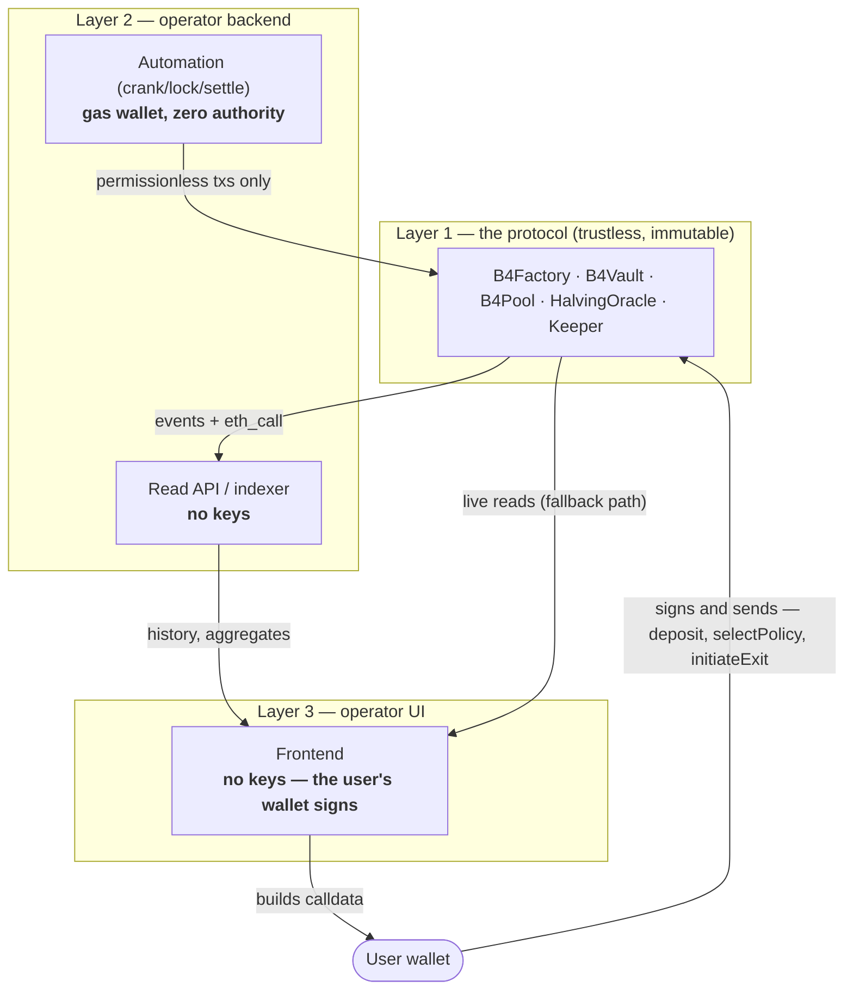

# Off-chain architecture: API, automation and UI

How to build the stack around B4 — what may be served from a backend, what must go straight to
the chain, and the one place automation is genuinely required.

> Status: B4 is **pre-mainnet and not externally audited**. Venue semantics are not locally
> provable and remain funded release gates — see [`../spec/SECURITY_MODEL.md`](../spec/SECURITY_MODEL.md) §5.

## The layering



**Layers 2 and 3 belong to the *operator*, not to the protocol.** There is no privileged
backend anywhere in B4: an operator is simply whoever runs an interface and puts their
`FeeRoute` into the vaults created through it (see [Roles](09-roles.md)). Several operators can
coexist, each with their own stack, and none is canonical to the protocol.

Because layer 2 only ever serves **public, chain-verifiable data**, a shared reference
implementation is perfectly reasonable — other interfaces can point at it instead of
re-indexing everything. The requirement is not that everyone self-hosts; it is that everyone
*can*: open source, a documented schema, and a UI that still works without it.

## Two hard rules

### 1. The API is never in the write path

Every state-changing call is signed by the party entitled to make it and sent straight to the
contract:

| Call | Signed by | Backend involvement |
|---|---|---|
| `deposit`, `selectPolicy`, `initiateExit`, `recover*` | the vault **owner** | none — the UI only builds the calldata |
| `crank`, `settle`, `claimDeferred`, pool `advance`/`lockPrices`/`sweep`/`capture`/`claimFor` | **anyone** | may be the operator's automation, or the user, or a third party |

The operator's only influence over the money path is the `FeeRoute` it puts into the calldata
the user signs at creation — after which the route is **immutable**. A backend that relayed
transactions would become a censorship and MITM surface and would reintroduce exactly the
trusted intermediary the protocol removes.

### 2. The UI must degrade to direct RPC

If the operator's backend is unavailable, the user must still be able to read their vault and
**exit**. Anything less hands the operator de-facto power to trap users, contradicting the
guarantee that an operator can never block an exit. Everything needed for that path —
`navWad()`, `currentTarget()`, `intent()`, `exitShareWad()`, `initiateExit`, `crank` — is
directly callable on the vault.

## What is live-only, and what can be indexed

This split falls out of the code, not from preference.

**Live `eth_call` only — not reconstructible from event logs.** These read HyperCore
precompiles through `CoreReader` (spot balance, perp position, withdrawable, mark/spot price),
so they exist only as *current* chain state; there is no historical archive of them:

```
navWad()  ·  strategyValueWad()  ·  currentTarget()
intent()  ·  coreDirWei / coreUsdcRotatedWei / coreUsdcMarginWei / perpMargin6
```

**Compute client-side from block time — never from a cached field.** These are pure functions
of `t = now − halvingTs` in `Calendar`, and a stale answer costs the user real money:

| Value | Cost of being wrong |
|---|---|
| `freeExit(t)` | an exit priced at the `q ≈ 11.8%` penalty instead of free |
| `depositOpen(t)` | a reverted deposit |
| `zoneAt(t)` / `targetAt(t, growth, fall)` | a wrong expectation of what the vault will do |

Take `halvingTs` from `HalvingOracle.latest()` and evaluate the rest locally. Mirroring
`Calendar`'s arithmetic in the client is a few lines and removes the backend from every
penalty-bearing decision.

**Genuinely belongs in the API** — needs history or cross-block aggregation:

| Data | Source |
|---|---|
| Vault lifecycle feed | `Initialized`, `Deposited`, `PolicySelected`, `ExitInitiated`, `ExitFinalized` |
| Async execution trace | `IntentCreated`, `IntentCompleted`, `IntentResent`, `IntentCleared`, `SpotTraded` |
| Settlement history and fees | `Settled(intervalId, navWad, profitWad, feePaidWad)`, `FeePaid` |
| Reward accrual and claims | `IntervalMaterialized`, `PricesLocked`, `WeightReported`, `Claimed`, `ClaimDeferred`, `Swept`, `Captured` |
| Outstanding deferred payouts | `PayoutDeferred` vs `DeferredPayoutClaimed` |
| Perp accounting detail | `HarvestRecorded`, `HarvestSettled`, `LossReconciled`, `MarginReturned` |
| Epoch history | `HalvingAccepted(epoch, height, timestamp, headerHash)` |
| Operator dashboard | own vaults, fees earned, unreported intervals, stalled cranks |

**Historical valuation, done honestly.** Per-second NAV cannot be backfilled (it reads live
Core state). What *is* on-chain and historical is the settlement checkpoint price:
`B4Pool.lockedPxWad(id, assetIndex)`, committed once per interval inside the snapshot window.
So the correct unit for charts is **the interval, not the tick** — reconstructed from the
chain rather than from a backend's own snapshots. If you want a finer series, you must record
it yourself and label it as your data, not as protocol state.

Always return `blockNumber` and a timestamp with every response so a client can tell how stale
an answer is.

## Automation: what actually needs a gas wallet

Permissionless means *anyone may call* — not that the call happens by itself. Somebody has to
send the transaction and pay gas. That is the only reason an operator runs a key at all.

**The sharp case: `lockPrices` has a one-hour window.**

```solidity
if (block.timestamp < it.pointTime
    || block.timestamp > it.pointTime + Calendar.SNAPSHOT_WINDOW)   // 1 hour
    revert OutsideSnapshotWindow();
```

Miss it and the interval is **never** priced: `currentReportable()` stays false, nobody in that
pool can `settle`, the operator loses that interval's fee and every vault loses its reward
weight for it. Since settlement points fall at `P−H` and `T+H`, that window recurs roughly once
a year and a half. Expecting a human to hit it manually is not an operating plan.

**Also impractical to leave to the user:** completing their own async intents (a deposit's
funding is create → prove → complete across several blocks — asking the user to sign each step
means most simply won't, and their capital sits undeployed), and tracking the continuously
interpolated target through the two 20-day transitions.

### The automation key has zero authority

This is not a privileged signer. It is a wallet that pays gas:

- it can call only what **any** address can call;
- it cannot move funds, choose targets, markets, prices, slippage or recipients, change a fee
  route, or block an exit;
- if it is compromised, the attacker gains the ability to **crank** — which everyone already
  has. The loss is the gas sitting in it.

Operational posture is therefore "keep it funded and monitored", not "protect a privileged
key". Keep it separate from any deployment key, which is a different matter entirely.

### Minimum viable automation

| Cadence | Action | Why |
|---|---|---|
| within 1 h of each settlement point | `advance()` then `lockPrices(id)` | hard window; missing it burns the interval for the whole pool |
| within the report window (1 h + 2 d) | `settle(id)` per vault | pays the operator and reports client weight |
| minutes, during the two 20-day transitions | `crank(vault)` | the target is moving; this is where the product earns |
| after any owner action | `crank(vault)` until idle | completes funding / exit intents |
| opportunistically | `sweep`, `capture`, `claimFor`, `claimDeferred` | rolls inventory forward and pays owners |

`Keeper.crank(pool, vaults, maxVaultSteps)` batches all of this, isolating every per-vault call
so one malformed entry cannot roll back the rest — see [Keeper operations](08-keeper.md).

### Liveness never depends on one operator

Because every step is permissionless, a stalled operator is not a stuck protocol: the user can
crank from the UI, another operator can crank the same vault, and any participant can call
`lockPrices` — which benefits every vault in that pool at once, so the incentive to call it is
shared. An operator monopolises **its fee**, never **liveness**. The worst case of a stalled
step remains delayed liveness, never loss of funds.

## Checklist for a new operator

- [ ] Deploy nothing privileged — the contracts are already immutable and ownerless.
- [ ] Choose a `FeeRoute` (`operatorBps ≤ 3819`; a referrer, if set, takes a protected share of *your* payment).
- [ ] Index the events above; expose `blockNumber` + timestamp on every response.
- [ ] Serve live vault state via `eth_call`; never cache `navWad` / `currentTarget` as truth.
- [ ] Compute zone, `freeExit` and `depositOpen` **client-side** from `HalvingOracle.latest()`.
- [ ] Run automation from a funded, authority-free gas wallet; alert on low balance.
- [ ] Alert on the two settlement points specifically — the 1-hour lock window is the only unforgiving deadline in the system.
- [ ] Verify the UI's read and exit paths still work with the backend switched off.

## Further reading

- [Roles](09-roles.md) — who earns what, and why the operator is the one who cranks
- [Keeper operations](08-keeper.md) — the crank loop in detail
- [Integration](04-integration.md) — every signature referenced above
- [Core concepts](02-core-concepts.md) — the calendar arithmetic to mirror client-side
